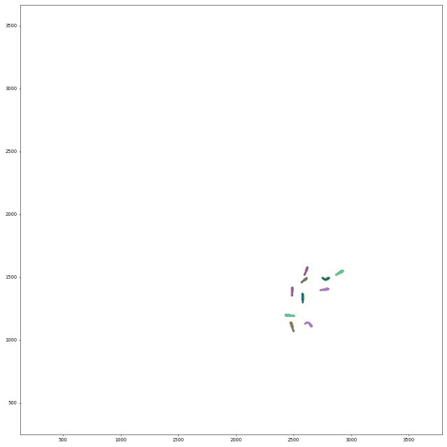
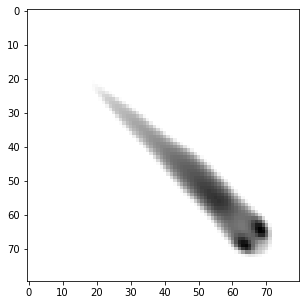
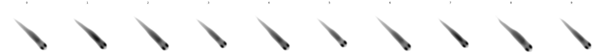

.. include:: names.rst

.. toctree::
   :maxdepth: 2

File formats
************

Positional Data
===============

Upon hitting the ``S`` key/clicking the export tracking data button in the menu, or when using the ``auto_quit`` option, 
|trex| will save one file per individual. They are, by default, saved to ``data/[VIDEONAME]_fish[NUMBER].npz`` and contain 
all of the data fields selected from the export options.

.. NOTE::

  Variable names, user-specified or exported from |trex|, can have attachments indicated by ``#`` (such as ``X#wcentroid``). 
  The text after ``#`` is the "source" for the data, of which there are four different ones:

  - ``#head`` or empty (default): **head position** (only available if postures are calculated)
  - ``#wcentroid``: **body center** (based on weighted image/pixel information)
  - ``#centroid``: **body center** (center of mass of all thresholded pixels)
  - ``#pcentroid``: **posture centroid** (the center of the midline)
  
  The resulting data can differ between data sources to varying degrees, depending on the posture detection, 
  size and movement speed of individuals. This is most notable during sharp turns, where the body center (centroid)
  will remain fairly stable while the head position moves quickly (and thus also has higher SPEED).

  Make sure you are using the most suitable one for your purposes.

+------------------------+----------------------------------------------------------------------------------------------------------------------------------------------------------------------------------------------------------------------------------------------------------------------------------------------------------------------+
| Variable               | Description                                                                                                                                                                                                                                                                                                          |
+========================+======================================================================================================================================================================================================================================================================================================================+
| X,Y                    | Position on the X/Y-axis. Y starts on the top-left. Both are in cm (if :param:`cm_per_pixel` is set correctly, otherwise the conversion is based on an assumed width of 30cm for the arena). If :param:`output_interpolate_positions` is set, then this value can be an interpolated value (if `missing` is also 1). |
+------------------------+----------------------------------------------------------------------------------------------------------------------------------------------------------------------------------------------------------------------------------------------------------------------------------------------------------------------+
| missing                | Set to 0 if the individual has data in this frame, or 1 otherwise.                                                                                                                                                                                                                                                   |
+------------------------+----------------------------------------------------------------------------------------------------------------------------------------------------------------------------------------------------------------------------------------------------------------------------------------------------------------------+
| SPEED                  | Magnitude of the first derivative of position (in cm/s).                                                                                                                                                                                                                                                             |
+------------------------+----------------------------------------------------------------------------------------------------------------------------------------------------------------------------------------------------------------------------------------------------------------------------------------------------------------------+
| VX,VY                  | X/Y-component of the first derivative of position (in cm/s).                                                                                                                                                                                                                                                         |
+------------------------+----------------------------------------------------------------------------------------------------------------------------------------------------------------------------------------------------------------------------------------------------------------------------------------------------------------------+
| AX,AY                  | X/Y-component of the acceleration in cm/s (if :param:`cm_per_pixel` is set correctly, otherwise the conversion is based on an assumed width of 30cm for the arena).                                                                                                                                                  |
+------------------------+----------------------------------------------------------------------------------------------------------------------------------------------------------------------------------------------------------------------------------------------------------------------------------------------------------------------+
| time                   | Time in seconds (floating point) from the start of the video, consistent across individuals.                                                                                                                                                                                                                         |
+------------------------+----------------------------------------------------------------------------------------------------------------------------------------------------------------------------------------------------------------------------------------------------------------------------------------------------------------------+
| timestamp              | The time as a UNIX timestamp.                                                                                                                                                                                                                                                                                        |
+------------------------+----------------------------------------------------------------------------------------------------------------------------------------------------------------------------------------------------------------------------------------------------------------------------------------------------------------------+
| frame                  | Montonically increasing integer number, consistent across individuals. Note: when exporting to CSV/NPZ, the individual files do not *have* to start at frame ``0``, and do not have to contain all frames from ``0`` to ``N``.                                                                                       |
+------------------------+----------------------------------------------------------------------------------------------------------------------------------------------------------------------------------------------------------------------------------------------------------------------------------------------------------------------+
| num_pixels             | The number of pixels in the blob (after thresholding).                                                                                                                                                                                                                                                               |
+------------------------+----------------------------------------------------------------------------------------------------------------------------------------------------------------------------------------------------------------------------------------------------------------------------------------------------------------------+
| ANGLE                  | The absolute angle in radians with respect to the X-axis of the image (e.g. 0rad indicates the individual is horizontal, looking to the right). You can convert this to degrees using ANGLE/pi*180.                                                                                                                  |
+------------------------+----------------------------------------------------------------------------------------------------------------------------------------------------------------------------------------------------------------------------------------------------------------------------------------------------------------------+
| blobid                 | Each objects gets a (more or less) unique identifier per frame, based on its position and size. This ID is saved here, and is what's used for manual assignments of individuals to objects, for example.                                                                                                             |
+------------------------+----------------------------------------------------------------------------------------------------------------------------------------------------------------------------------------------------------------------------------------------------------------------------------------------------------------------+
| midline_length         | The length of the midline for the given frame (in pixels) - the sum of all euclidean distances between midline segments.                                                                                                                                                                                             |
+------------------------+----------------------------------------------------------------------------------------------------------------------------------------------------------------------------------------------------------------------------------------------------------------------------------------------------------------------+
| outline_size           | The number of points in the outline of the individual. This can be used as a coarse approximation of individual size.                                                                                                                                                                                                |
+------------------------+----------------------------------------------------------------------------------------------------------------------------------------------------------------------------------------------------------------------------------------------------------------------------------------------------------------------+
| tracklet_id            | Each consecutively tracked frame segments gets an ID, which is returned here.                                                                                                                                                                                                                                        |
+------------------------+----------------------------------------------------------------------------------------------------------------------------------------------------------------------------------------------------------------------------------------------------------------------------------------------------------------------+
| average_category       | This applies only to videos where visual categorization of individuals has been applied. Here, the average category represents the predicted class for this individual, within the current consecutively tracked frame segment.                                                                                      |
+------------------------+----------------------------------------------------------------------------------------------------------------------------------------------------------------------------------------------------------------------------------------------------------------------------------------------------------------------+
| category               | As above, but not averaged and instead saved individually per frame.                                                                                                                                                                                                                                                 |
+------------------------+----------------------------------------------------------------------------------------------------------------------------------------------------------------------------------------------------------------------------------------------------------------------------------------------------------------------+
| BORDER_DISTANCE        | Usually this is the distance from the centroid of the individual to the edge of the image - in case a :param:`cam_circle_mask` has been used during conversion, the circle is used as an approximation of the tank size.                                                                                             |
+------------------------+----------------------------------------------------------------------------------------------------------------------------------------------------------------------------------------------------------------------------------------------------------------------------------------------------------------------+
| NEIGHBOR_DISTANCE      | Average euclidean distance to neighbors (in cm).                                                                                                                                                                                                                                                                     |
+------------------------+----------------------------------------------------------------------------------------------------------------------------------------------------------------------------------------------------------------------------------------------------------------------------------------------------------------------+
| MIDLINE_OFFSET         | The offset of the tail of an individual to the center line through its body (roughly speaking). More specifically, it is the y-coordinate of the tail tip, after normalizing the orientation and position of the individual (as in the posture window).                                                              |
+------------------------+----------------------------------------------------------------------------------------------------------------------------------------------------------------------------------------------------------------------------------------------------------------------------------------------------------------------+
  

Each of these metrics is saved per frame, meaning that each metric mentioned here has the same number of values per individual. However, not all individuals have the same number of frames and do not necessarily start at the same time (even though the time variable is consistent across individuals). If an individual is first detected later in the video (not in the first frame), then that frame is the first one to appear in the exported data. Individuals may also not appear towards the end of the video, in which case there also won't be any data exported for that part.

.. NOTE::
	There are a couple hashtags in there -- these simply mean that the data-source for that metric is different. For example, ``wcentroid`` means that this metric is centered on the centroid (weighted by pixel values) of each individual. If no hashtag is provided, the metric centers on the head of each individual. These are usually closely related, but are different from each other e.g. when the individual moves its head independently from other parts of the body. There the head-based metric would show much more wiggling around than the centroid-based metric.

If one metric (such as anything posture-related) is not available in a frame -- either because the individual was not found, or because no valid posture was found -- then all affected metrics (sometimes all) will be set to ``infinity``. A typical way of opening such a file and plotting a trajectory would be::

    import numpy as np
    import matplotlib.pyplot as plt
    
    with np.load("video_fish0.npz") as npz:
        # sample output: ['threshold_reached', 'num_pixels', 'time',     \
        #     'midline_length', 'frame', 'Y#wcentroid', 'Y', 'missing',  \
        #     'X', 'SPEED', 'SPEED#pcentroid', 'MIDLINE_OFFSET',         \
        #     'X#wcentroid', 'SPEED#wcentroid']
        print(npz.files)
        
        X = npz["X#wcentroid"]
        Y = npz["Y#wcentroid"]
        
        # sample output: (30269,)
        # just a stream of X positions for fish0
        print(X.shape)
        
        # using the mask gets rid of np.inf values (otherwise the plot
        # might get weird). "missing" is 1 whenever the individual is 
        # not tracked in that frame:
        mask = ~npz["missing"].astype(np.bool)
        
        # plot a connected trajectory for fish0:
        plt.figure(figsize=(5,5))
        plt.plot(X[mask], Y[mask])
        plt.show()

Posture-data
============

For each individual (as long as :param:`output_posture_data` is set to ``true``), |trex| writes a file ``[output_path]/[FILENAME]_posture_*.npz`` containing the following fields:

.. raw:: html

	

.. csv-table::
	:header: Name,Description
	:widths: 15, 35
	:stub-columns: 1
	
	frames, "Frame index for all data contained in all other arrays."
	offset, "Top-left corner (px) of the object that this posture was generated from."
	midline_lengths, "Number of points in the midline."
	midline_centimeters, "Length of the midline in cms (based on the :param:`cm_per_pixel` parameter)"
 	midline_offsets, "A bit obscure: Angle (rad) from start to end of the midline (line through first and last point)."
	midline_angle, "Angle (rad) of a line from head-position (first midline segment) through the midline segment at a fraction of :param:`midline_stiff_percentage` of the midline - approximating the heading of the individual."
	posture_area, "Area of the polygon spanned by the outline points (calculated using the Shoe lace formula)."
	midline_points, "2D Points (px) of the midline in real-world coordinates."
	midline_points_raw, "2D Points (px) of the midline in normalized coordinates."
	outline_lengths, "Number of points in the outline."
	outline_points, "Each outline point consists of X and Y, but each outline can be of a different length. To iterate through these points, one must keep a current index that increases by ``outline_lengths[frame]`` per frame."

For an example of how to use this data, have a look at `this <https://github.com/mooch443/trex/blob/master/docs/scripts/plot_posture_output.py>`_ example from the repository. It demonstrates loading all posture files from one video, drawing the posture output in matplotlib and saving it to a new movie file. This is what the output could look like:

Tracklet images
===============

Tracklet images can be quite useful when a different software has to perform operations on individual images (or summary-images per segment), like, for example, using DeepLabCut or DeepPoseKit to estimate poses in more detail -- after tracking and visual identification in |trex| have ensured that we know who is whom. Interoperability between the tools can have other advantages, too. Images can be normalized, for example, and become easier to annotate manually -- these altered video sequences can be saved for each individual.

.. image:: collection.gif

The container ``<VIDEO>_tracklet_images.npz`` contains summaries of all tracklets for each individual in the form of ``['images', 'meta']``, where ``meta`` is matrix of ``Nx3`` (where ``N`` is the number of segments). The three columns are ID, segment start and segment end (frame numbers). Images is a matrix of ``NxWxH`` depending on the image dimensions set in :param:`individual_image_size`.

.. code:: ipython3

    import numpy as np
    import matplotlib.pyplot as plt

Open all images of a certain individual ID
------------------------------------------

.. code:: ipython3

    with np.load("Videos/data/video_tracklet_images_single_part0.npz") as npz:
        print(npz.files)
        
        images = npz["images"]  # load images
        ids    = npz["ids"]     # ids have the same length as images
        frames = npz["frames"]  # the frame for each row
        
        # so we can use them as a mask for the images array:
        print(images[ids == 0].shape)
        
        # now draw a median image of this fish. since it is normalized (orientation),
        # it will be a nice, clean picture of what it looks like most of the time.
        # if it does not, then your posture settings are probably off.
        # this only works after successful visual identification + correction of course.
        plt.figure(figsize=(5,5))
        plt.imshow(np.median(images[ids == 0], axis=0), cmap="Greys")
        plt.show()

.. parsed-literal::

    ['images', 'frames', 'ids']
    (19247, 80, 80)
    

Now we want to see that for all individuals
-------------------------------------------

But we are using the meta tracklet pack for this. It contains only one
image per consecutive segment.

.. code:: ipython3

    with np.load("Videos/data/video_tracklet_images.npz") as npz:
        meta = npz["meta"]
        N = len(np.unique(meta[:, 0])) # how many fish do we have here?
        
        # plot all individuals in a row. this will probably be real tiny for many more individuals.
        f, axes = plt.subplots(1, N, figsize=(5*N, 5))
        for ax, i in zip(axes, np.unique(meta[:, 0])):
            ax.axis('off')
            ax.imshow(np.median(npz["images"][meta[:, 0] == i], axis=0), cmap="Greys")
            ax.set_title(str(i))
        plt.show()

We can now map from segments (meta) to tracklet images from the big file
------------------------------------------------------------------------

.. code:: ipython3

    for ID, start, end in meta:
        mask = np.logical_and(ids == ID, np.logical_and(frames >= start, frames <= end))
        print(ID, start,"-",end, images[mask].shape)

.. parsed-literal::

    0 0 - 40 (41, 80, 80)
    0 42 - 50 (9, 80, 80)

    [...]
    
    9 19235 - 19242 (8, 80, 80)
    9 19245 - 19251 (7, 80, 80)
    9 19252 - 19305 (54, 80, 80)
    9 19306 - 19316 (11, 80, 80)
    

Visual fields
=============

Visual fields are saved by clicking the respective menu button ("export visual fields") in |trex|. This will save one or multiple files, depending on file size. If the files are bigger than ~3GB, then they have to be saved separately in individual .npy files - otherwise they will all be merged into one .npz container called e.g. ``data/<VIDEONAME>_visual_field_fish0.npz``.

Each container holds multiple arrays, each are shaped ``Nx2x2x512`` for ``N`` frames, 2 eyes and 2 depth-layers per eye:

	- **depth**: distance to the visible individual (or ``INFINITY == none``; see also `this github issue <https://github.com/mooch443/trex/issues/95#issuecomment-1079142959>`_)
	- **ids**: id of the visible individual (or ``-1`` for self-intersection)
	- **body_part**: a percentage that indicates how far from the head (and how close to the tail) the point on the seen individual is on its outline

as well as some meta data:

	- **colors**: (``Mx4``): ID + RGB for M individuals
	- **fov_range** (``2x1``): FOV range in radians
	- **frame_range** (``2x1``): Start and end of exported region
	- **fish_pos** (``Nx2``): XY position of the individual for each frame
	- **fish_angle** (``Nx1``): angle of the body relative to the x-axis
	- **eye_pos** (``Nx2x2``): XY position for each eye
	- **eye_angle** (``Nx2``): angle for each eye
	- **frames** (``Nx1``): frame index

Heatmaps
========

Saved are npz files named like::

	data/<videoname>_heatmap_p0_<cellsize>_<width>x<height>.npz

Where ``<cellsize>`` is the grid cell size and ``<width>x<height>`` is the resolution of the heatmaps (interpreted as images). It contains (for example)::

	['heatmap', 'frames', 'meta']
	heatmap.shape = (4999, 2, 47, 47)
	frames.shape = (4999,)
	meta = [0.0, 64.0, 2.0, 4999.0]

Where ``meta`` is an array of:

- Package index
- :param:`heatmap_resolution`
- type of :param:`heatmap_normalization`
- number of frames used as context (usually :param:`heatmap_frames` or :param:`video_length`)

Here's a small example of how to load and plot the heatmap data:

.. code:: ipython3

	import numpy as np
	import matplotlib.pyplot as plt

	# Load the heatmap data file
	heatmap_file = "data/video_heatmap_p0_4_47x47.npz"  # adjust filename as needed
	with np.load(heatmap_file) as data:
		# Extract the heatmap, frames, and meta data
		heatmap = data['heatmap']
		frames = data['frames']
		meta = data['meta']

		# Print the shape of the heatmap
		print(f"Heatmap shape: {heatmap.shape}")
		print(f"Frames shape: {frames.shape}")
		print(f"Meta data: {meta}")

	# Plot the heatmap for the first frame (using the first channel)
	plt.figure(figsize=(6, 6))
	plt.imshow(heatmap[0, 0, :, :], cmap='hot', interpolation='nearest')
	plt.title(f"Heatmap (Frame: {frames[0]})")
	plt.colorbar(label='Intensity')
	plt.show()

PreprocessedVideo (pv)
======================

Videos in the PV format are structured as follows::

  **[HEADER SECTION]**
  (string) "PV" + (version_nr)
  (string) encoding name    (replaces the previous “channels” field; e.g. "gray", "rgb8", "r3g3b2")
  (uint16) width
  (uint16) height
  (Rect2i) four ushorts with the mask-offsets left,top,right,bottom
  (int64) conversion range start    (value or -1 if not used)
  (int64) conversion range end      (value or -1 if not used)
  (string) original source      (video file path or identifier)
  (uchar) sizeof(HorizontalLine)    (number of bytes per mask line)
  (uint32) number of frames    (placeholder; updated when finalizing the file)
  (uint64) pointer to index at the end of file
  (uint64) timestamp (time since 1970 in microseconds)
  (string) project name
  (byte*)  average img ([width x height] x channels)
  (uint64) mask present / mask size in bytes (if 0 no mask)
  [byte*]  mask, but only present if mask_size != NULL
  
  **[DATA SECTION]**
  for each frame:
    (uchar) compression flag (if 1, the whole frame is compressed)
    if compressed:
      (uint32) original size
      (uint32) compressed size
      (byte*) lzo1x compressed data (see below for uncompressed)
    else:
      [UNCOMPRESSED DATA PER FRAME] {
        (uint64) frame timestamp    (in microseconds since start of movie)
        (uint16) number of objects    (cropped images or blobs)
        (uint32) source frame index    (or -1 if not available)
        
        For each object/blob:
          (uint16) y of first HorizontalLine    (0 if mask is empty)
          (uint8) flags    (encoding properties, e.g. RGB, binary, or alternative such as r3g3b2)
          (uint16) number of HorizontalLine entries
          (byte*) compressed mask data    (n * sizeof(HorizontalLine))
          (byte*) pixel data    (raw image pixels ordered as in HorizontalLines; present if encoding is not binary)
        
        (uint16) number of prediction entries
        For each prediction:
          (byte*) cmn::blob::Prediction data
      }
  
  **[INDEX TABLE]**
  For each frame:
    (uint64) frame start position in file
  
  **[METADATA]**
  (string) JSONized metadata array
  
  Where the HorizontalLine struct is made up of::
  
  (uint16) x0    (starting x-coordinate)
  (uint16) x1    (ending x-coordinate; least significant bit reserved as EOL flag)
  
  The EOL flag indicates that this line is the last on the current y-coordinate, meaning the y-counter should be incremented. This, together with the “y of first HorizontalLine”, is sufficient to reconstruct the entire object.