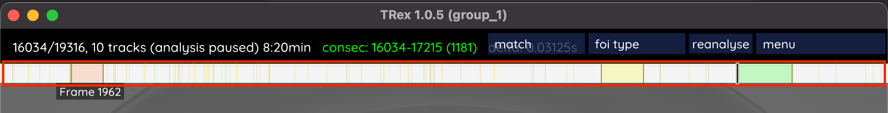
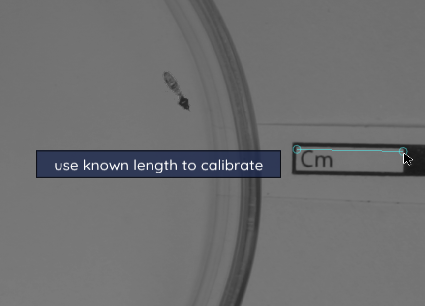
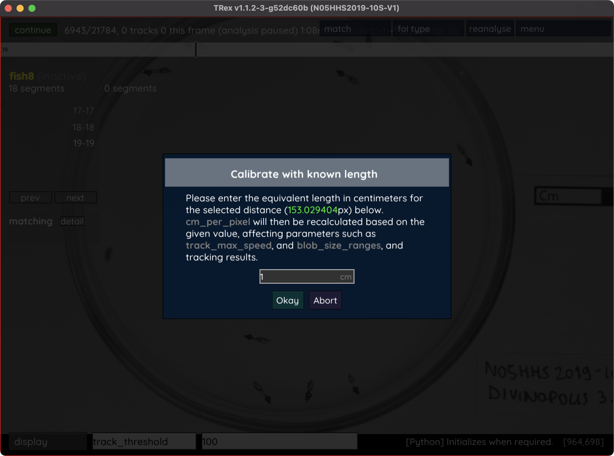
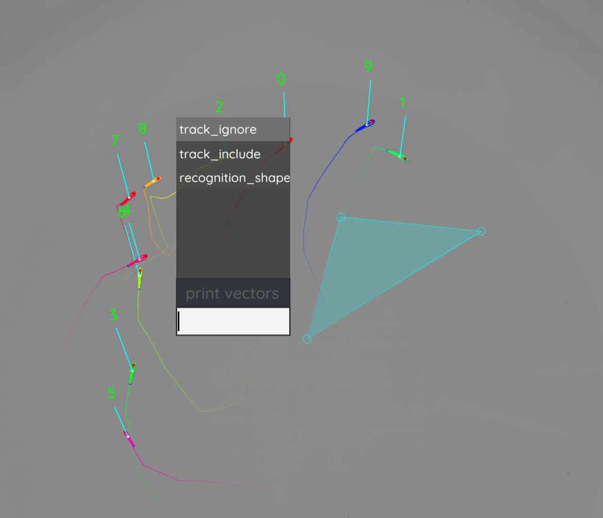
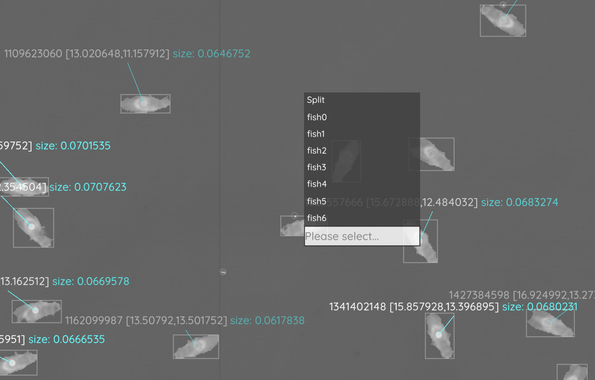

.. include:: names.rst

.. toctree::
   :maxdepth: 2

Using the graphical user interface
==================================

Generally, all the parameters for one specific task will be prefixed by ``task_``, so if you are searching for something like heatmap-related parameters, then simply search for ``heatmap`` in the interactive settings box on the bottom left (4) and you will see all options related to that topic. Each parameter shows inline documentation when hovering its name.

.. image:: ../images/trex_screenshot_web.png
	:width: 1024
	:alt: Overview of the TRex graphical user interface

Some parameter values cannot be changed (such as the build version of the software), but most parameters can be changed at runtime. When changing tracking parameters (prefixed by ``track_``), or posture parameters (prefixed either by ``outline_``, ``midline_``, or ``posture_``), then the video has to be reanalysed to see an effect. This is done by simply clicking on the "reanalyse" button on the top right (1). This button triggers |trex| to delete everything including the current and all following frames, and analyse them again with the new parameters. Some functionality will trigger such behavior automatically, for example when manually correcting identities (see below) where the video will be reanalysed automatically -- starting from the first assignment that has been changed. If you want to reanalyse the entire video, go to the first frame and click "reanalyse".

.. _`Keyboard shortcuts`:

Keyboard shortcuts
------------------

+-----------+------------------------------------------------------------------------------------------------+
| Key       | Action                                                                                         |
+===========+================================================================================================+
| Esc       | Terminate                                                                                      |
+-----------+------------------------------------------------------------------------------------------------+
| Right,    | Next frame                                                                                     |
| Return    |                                                                                                |
+-----------+------------------------------------------------------------------------------------------------+
| Left,     | Previous frame                                                                                 |
| Backspace |                                                                                                |
+-----------+------------------------------------------------------------------------------------------------+
| Space     | Start/stop playback                                                                            |
+-----------+------------------------------------------------------------------------------------------------+
| Comma     | Resume/pause analysis                                                                          |
+-----------+------------------------------------------------------------------------------------------------+
| B         | Show/hide posture preview when an individual is selected                                       |
+-----------+------------------------------------------------------------------------------------------------+
| T         | Show/hide timeline and some interface elements                                                 |
+-----------+------------------------------------------------------------------------------------------------+
| G         | Show/hide graph when an individual is selected                                                 |
+-----------+------------------------------------------------------------------------------------------------+
| D         | Switch to RAW view and back to tracking view                                                   |
+-----------+------------------------------------------------------------------------------------------------+
| M         | Jump to next frame where the number of recognized individuals changed (yellow in timeline)     |
+-----------+------------------------------------------------------------------------------------------------+
| N         | Jump to previous frame where the number of recognized individuals changed (yellow in timeline) |
+-----------+------------------------------------------------------------------------------------------------+
| R         | Playback frame-by-frame and save what you see in the tracker window as `<output_dir>/frames`   |
+-----------+------------------------------------------------------------------------------------------------+
| S         | Export data in :func:`output_graphs` to CSV files in `<output_dir>/data`                       |
+-----------+------------------------------------------------------------------------------------------------+
| Z         | Save program state to `<videoname>.results`                                                    |
+-----------+------------------------------------------------------------------------------------------------+
| L         | Load program state from `<videoname>.results`                                                  |
+-----------+------------------------------------------------------------------------------------------------+
| O         | Cycle through fish based on ID (backwards)                                                     |
+-----------+------------------------------------------------------------------------------------------------+
| P         | Cycle through fish based on ID (forward)                                                       |
+-----------+------------------------------------------------------------------------------------------------+

.. _`Timeline`:

Timeline
--------

The timeline works like the position indicator in your typical video player application. Click on it, hold the mouse button down and slide it around on the timeline to switch between frames.

It has some extra functionality, however. Sometimes you will see colorful things up there. If you set the number of individuals (:func:`track_max_individuals`), then you might get a green, a red, a yellow and a grey rectangle up there -- overlayed on the timeline. These indicate "good" segments for training (ranked as listed previously). If they are yellow/pink/etc. lines on your timeline, then they indicate problematic frames in your video. You can jump between them using the ``M``/``N`` keys on your keyboard (see `Keyboard shortcuts`_). The type of problem depends on your selection of "foi types" in the top menu.

Changing the cm/px conversion factor
------------------------------------

Usually the easiest way to set a conversion factor is in TGrabs, before the video is even segmented. TGrabs expects a parameter :func:`meta_real_width`, which contains the "real-world" size in X-direction of the present video and sticks with the video as integrated meta-data. However, in case you want to change this factor later on, you can do this from within TRex. Careful, though. Doing this changes what the values in :func:`track_max_speed` and even :func:`blob_size_ranges` mean (and thus also tracking results)!

Depending on your operating system, hold ⌘ or ``CTRL`` (depending on your operating system) and click on two points on the background - the distance between them is supposed to be a "known length" - for example, if you have a cm strip integrated into your video background for reference.

|trex| will then offer to use this known length to calculate the conversion factor.

In order to keep the applied changes, don't forget to save your config (Menu -> Save Config) and/or copy your :func:`cm_per_pixel` parameter. You may need to reanalyse the video to apply all changes.

Display menu
------------

Different visualisations can be enabled or disabled using the display menu (4) on the bottom left. Expand the "display" list by clicking on it, and you will see various options -- including the heatmaps feature, posture (for which you can also use the 🄱 key), outlines/midlines (a full list can be found below):

.. image:: ../images/trex_display_options.png
	:width: 200
	:alt: All current display options
	:align: center

- export options
	Toggles a movable window showing all possible output fields (for when you press 🅂/click on "menu" -> "save tracking data"). (This is currently a bit basic and will be updated in a future version.)
- zoom on selected
	Whether to zoom in on the selected individual or not. Can be combined with the next option.
- auto zoom
	Always try to keep all individuals in-view, but zoom in if possible.
- visual field ts
	The timeseries of the visual field of the first selected individual. This includes left/right eye and all data-streams associated with it (distance/id, body-part).
- visual field
	Display visual fields of all selected individuals in the GUI.
- recognition
	Toggles display of recognition-related info in the tracking view (per object accuracy percentages).
- confusion
	A matrix in the center of the screen, only available after clicking "menu" -> "auto correct" -> "No".
- dataset
	Display information about the consecutive segment in the currently viewed frame. This includes stats per individual like midline length variance, as well as (if available) identities as predicted by the neural network.
- #individuals
	A graph that shows the number of individuals per frame (only shows data for frames analysed in the current session, not loaded frames).
- heatmap
	Show a heatmap with customizable properties. Search ``heatmap_`` in the settings box to find all available options. By default it shows a density map for positions of individuals in the whole video.

Excluding regions / tracking specific regions exclusively
---------------------------------------------------------

Despite available remedies (i.e. using a different :func:`averaging_method`, :func:`correct_luminance`), sometimes noisy regions in recordings are unavoidable. This can be either due to, for example, changing lighting conditions, or certain parts of the experimental setup moving over time. 

When you are converting the video, and noise concentrates on the outer edges of the image / outside the area of interest, it is possible to specify :func:`crop_offsets` to |grabs| like::

	tgrabs -i video.mp4 -crop_offsets [0.05,0,0.05,0.1]

Adding the parameter ``crop_offsets`` crops 5% of the image from the left, 0% from the top, 5% from the right, and 10% from the bottom.

Otherwise you may also specify areas of arbitrary shape during tracking (e.g. in |trex|). This is either done graphically via mouse-clicks, or by setting :func:`track_ignore` to the coordinates manually. The coordinates describing the shape are given to ``track_ignore`` in the format::

	array of arrays[array of vectors]

An example from a hypothetical settings file could thus be::

	track_ignore = [[[0,100],[100,100],[50,150]]]

which describes a triangle with the coordinates 0,100 and 100,100 as it's base and 50,150 as it's pointy end.

	
	Here, a triangle was selected using CTRL/⌘-Click on multiple points. This shape can now be added to parameters like ``track_ignore``.

Within the graphical user-interface you can set these points by clicking on them, which is usually easier. It works in both the tracking and raw views, but it is sometimes easier to do in raw view (press 🄳). Now, simply click on some empty space (not on an object) and, while holding CTRL/⌘, click on additional points to define a shape. During this process a button appeared, as well as a text-field (where you placed your first point). Click on the text-field and enter ``track_ignore`` and select ``track_ignore`` from the results. Switch back to tracking view and the shape you defined should be highlighted (red).

Any object with it's center within the boundaries of this (convex) shape will now be ignored during tracking. To apply this to your already tracked video, please go to frame 0 and click reanalyse. Now you may play the video back and see if all objects have been excluded properly during tracking.

Manually assigning individuals
------------------------------

First, press 🄳 to get into raw mode [1]_. Clicking on the small white circle inside objects reveals an assignment menu, where you can either enter a specific number or select one of the individual IDs in the list.

This change will be kept even if previous tracking changes, so be sure to go about this chronologically. Changing assignments in earlier parts of a video will affect later parts of the video since these parts are retracked and IDs might differ (unless corrected by automatic indentification, in which case manual corrections are usually not needed anyway).

	The small white circles inside objects are clickable and will open a menu where you can choose to manually assign an individual to this object.

The individual will now be assigned in *this* frame to *this* object, which does not mean that it will stay that way in the future. Manual matches override automatic matches (by visual identification + auto correction), but only in the given frame. To override automatic matches for an entire segment, please select the individual first, go to the start frame of that segment and click on the small "delete" button in the matching info card on the left. Now all automatic matches for this specific segment are deleted and you can manually assign the individual to other objects.

.. [1] In that mode, tracking info is invisible and only the thresholded objects are displayed (see figure :numref:`raw-mode-menu`).

