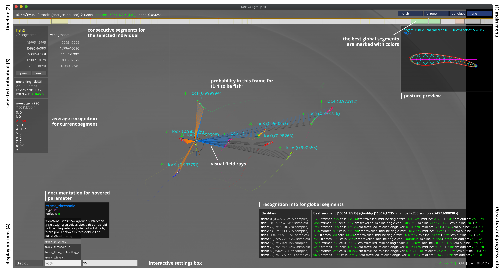
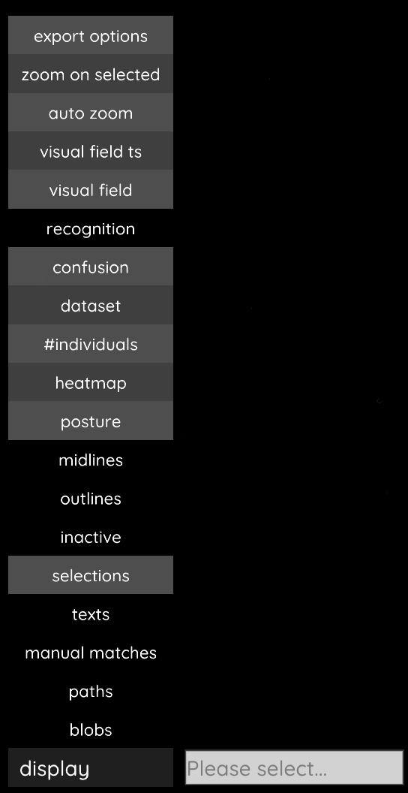

.. include:: names.rst

.. toctree::
   :maxdepth: 2

Using the graphical user interface
==================================

Generally, all the parameters for one specific task will be prefixed by ``task_``, so if you are searching for something like heatmap-related parameters, then simply search for ``heatmap`` in the interactive settings box on the bottom left (4) and you will see all options related to that topic. Each parameter shows inline documentation when hovering its name.

Some parameter values cannot be changed (such as the build version of the software), but most parameters can be changed at runtime. When changing tracking parameters (prefixed by ``track_``), or posture parameters (prefixed either by ``outline_``, ``midline_``, or ``posture_``), then the video has to be reanalysed to see an effect. This is done by simply clicking on the "reanalyse" button on the top right (1). This button triggers |trex| to delete everything including the current and all following frames, and analyse them again with the new parameters. Some functionality will trigger such behavior automatically, for example when manually correcting identities (see below) where the video will be reanalysed automatically -- starting from the first assignment that has been changed. If you want to reanalyse the entire video, go to the first frame and click "reanalyse".

Different visualisations can be enabled or disabled using the display menu (4) on the bottom left. Expand the "display" list by clicking on it, and you will see various options -- including the heatmaps feature, posture (for which you can also use the ``B`` key), outlines/midlines (a full list can be found below):

- export options
	Toggles a movable window showing all possible output fields (for when you press ``S``/click on "menu" -> "export tracking data"). (This currently a bit crude and will be updated in a future version.)
- zoom on selected
	Whether to zoom in on the selected individual or not. Can be combined with the next option.
- auto zoom
	Always try to keep all individuals in-view, but zoom in if possible.
- visual field ts
	The timeseries of the visual field of the first selected individual. This includes left/right eye and all data-streams associated with it (distance/id, body-part).
- visual field
	Display visual fields of all selected individuals in the GUI.
- recognition
	Toggles display of recognition-related info in the tracking view (per object accuracy percentages).
- confusion
	A matrix in the center of the screen, only available after clicking "menu" -> "auto correct" -> "No".
- dataset
	