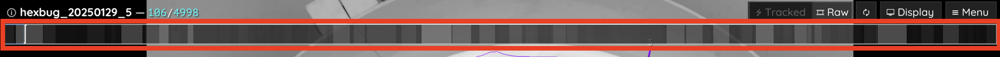

.. include:: names.rst

.. toctree::
   :maxdepth: 2

Using the graphical user interface
==================================

Generally, all the parameters for one specific task will be prefixed by ``task_``, so if you are searching for something like heatmap-related parameters, then simply search for ``heatmap`` in the interactive settings box on the bottom left (4) and you will see all options related to that topic. Each parameter shows inline documentation when hovering its name.

.. image:: ../images/trex_screenshot_web.png
	:width: 1024
	:alt: Overview of the TRex graphical user interface

Some parameter values cannot be changed (such as the build version of the software), but most parameters can be changed at runtime. When changing tracking parameters (prefixed by ``track_``), or posture parameters (prefixed either by ``outline_``, ``midline_``, or ``posture_``), then the video has to be reanalysed to see an effect. This is done by simply clicking on the "reanalyse" button on the top right (1). This button triggers |trex| to delete everything including the current and all following frames, and analyse them again with the new parameters. Some functionality will trigger such behavior automatically, for example when manually correcting identities (see below) where the video will be reanalysed automatically -- starting from the first assignment that has been changed. If you want to reanalyse the entire video, go to the first frame and click "reanalyse".

.. _`Keyboard shortcuts`:

Keyboard shortcuts
------------------

.. list-table:: Keyboard shortcuts
   :widths: 10 40
   :header-rows: 1

   * - Key
     - Action
   * - ⎋ Esc
     - Quit
   * - → Right / ↵ Return
     - Next frame
   * - ← Left / ⌫ Backspace
     - Previous frame
   * - ␣ Space
     - Play/pause
   * - ， Comma
     - Toggle analysis
   * - 🄱 B
     - Toggle posture preview
   * - 🅃 T
     - Toggle timeline
   * - 🄶 G
     - Toggle graph
   * - 🄳 D
     - Toggle RAW/tracking view
   * - 🄼 M
     - Jump to next frame of interest
   * - 🄽 N
     - Jump to previous frame of interest
   * - 🄲 C
     - Jump to previous tracklet of selected individual
   * - 🅅 V
     - Jump to next tracklet of selected individual
   * - 🅁 R
     - Export video
   * - 🅂 S
     - Export tracking data
   * - 🅉 Z
     - Save session
   * - 🄻 L
     - Load session
   * - 🄾 O
     - Cycle fish (back)
   * - 🄿 P
     - Cycle fish (forward)

.. _`Timeline`:

Timeline
--------

A timeline is shown at the top of the screen - it works like the position indicator in a typical video player application. Click on it, hold the mouse button down and slide it around on the timeline to switch between frames.

It also has some extra functionality. If you set the number of individuals (:param:`track_max_individuals`), then you might get different shades of grey up there. These indicate "good" segments for training (ranked as listed previously). The lighter the grey sections are, the better is the respective section of your video in terms of "properly tracking all individuals".

You can also use the arrow keys on your keyboard to move between frames. You can jump between sections of interest (i.e. when individuals are lost) using the ``M``/``N`` keys on your keyboard (see `Keyboard shortcuts`_).

Changing the cm/px conversion factor
------------------------------------

Usually the easiest way to set a cm/px factor is before the video is even segmented. Simply go to the "tracking" tab and click on ``Calibrate`` to start. However, in case you want to change this factor later on, you can do this from within |trex|. Careful, though. Doing this changes what the values in :param:`track_max_speed` and even :param:`track_size_filter` mean (and thus also tracking results)!

Depending on your operating system, hold ⌘ or ``CTRL`` (depending on your operating system) and click on two points on the background - the distance between them is supposed to be a "known length" - for example, if you have a cm strip integrated into your video background for reference.

|trex| will then offer to use this known length to calculate the conversion factor.

In order to keep the applied changes, don't forget to save your config (Menu -> Save Config) and/or copy your :param:`cm_per_pixel` parameter. You may need to reanalyse the video to apply all changes.

Display menu
------------

Different visualisation options can be enabled or disabled using the display menu on the top-right. Expand the "display" list by clicking on it, and you will see various options -- including the heatmaps feature, posture (for which you can also use the 🄱 key), outlines/midlines, etc.

	The display menu (top right) allows you to toggle different visualisation options.

Some of the more important options are:

- zoom on selection
	Whether to zoom in on the selected individual or not.
- visual field
	Display visual fields of all selected individuals in the GUI.
- video background
	Toggles display of the original video in the background (if available). This option is nice visually speaking, but can make playback slower.
- dataset information
	Display information about the tracklets in the currently viewed frame. This includes stats per individual like midline length variance, as well as (if available) identities predicted by applying a VI network.
- heatmap
	Show a heatmap with customizable properties. Search ``heatmap_`` in the settings box to find all available options. By default it shows a density map for positions of individuals in the whole video.

Excluding regions / tracking specific regions exclusively
---------------------------------------------------------

Despite available remedies (i.e. using a different :param:`averaging_method`, :param:`correct_luminance`), sometimes noisy regions in recordings are unavoidable. This can be either due to, for example, changing lighting conditions, or certain parts of the experimental setup moving over time. 

You can specify (convex) shapes to ignore during tracking (e.g. in |trex|). This is either done graphically via mouse-clicks, or by setting :param:`track_ignore` to the coordinates manually. The coordinates describing the shape are given to ``track_ignore`` in the format::

	<array of arrays>[<array of vectors>]

An example from a hypothetical settings file could thus be::

	track_ignore = [[[0,100],[100,100],[50,150]]]

which describes a triangle with the coordinates 0,100 and 100,100 as it's base and 50,150 as it's pointy end.

	
	Here, a triangle was selected using CTRL/⌘-Click on multiple points. This shape can now be added to parameters like ``track_ignore``.

Within the graphical user-interface you can set these points by CTRL/⌘ + clicking on them, which is usually easiest. It works in both the tracking and raw views, but it is sometimes easier to do in raw view (press 🄳). Now, holding CTRL/⌘, simply click on a point and keep holding the key + click on additional points to define a shape. During this process a button appeared, as well as a text-field (where you placed your first point). Click on the text-field and select ``track_ignore`` and select ``track_ignore`` from the options. Switch back to tracking view and find the shape you defined highlighted in red (or green depending on your choice).

Any object with it's center within the boundaries of this (convex) shape will now be ignored during tracking. To apply this to your already tracked video click reanalyse in the top-menu. Now you may play the video back and see if all objects have been excluded properly during tracking.

Sometimes noise always concentrates on the outer edges of the image / outside the area of interest. If you know what you're doing, you may also set some crop offsets directly when you are converting the video. Just specify :param:`crop_offsets` when launching |trex| like::

	trex -i video.mp4 -crop_offsets [0.05,0,0.05,0.1]

Adding the parameter ``crop_offsets`` crops 5% of the image from the left, 0% from the top, 5% from the right, and 10% from the bottom. Just be aware that this is a *destructive* action (in computer scientist terms) - it won't delete your original video, but it will exclude these regions and the only way you can get them back into your tracking data is through reconverting.

Manually assigning individuals
------------------------------

First, press 🄳 to get into raw mode [1]_. Clicking on the small white circle inside objects reveals an assignment menu, where you can either enter a specific number or select one of the individual IDs in the list.

This change will be kept even if previous tracking changes, so be sure to go about this chronologically. Changing assignments in earlier parts of a video will affect later parts of the video since these parts are retracked and IDs might differ (unless corrected by automatic indentification, in which case manual corrections are usually not needed anyway).

	The small white circles inside objects are clickable and will open a menu where you can choose to manually assign an individual to this object.

The individual will now be assigned in *this* frame to *this* object, which does not mean that it will stay that way in the future. Manual matches override automatic matches (by visual identification + auto correction), but only in the given frame. To override automatic matches for an entire segment, please select the individual first, go to the start frame of that segment and click on the small "delete" button in the matching info card on the left. Now all automatic matches for this specific segment are deleted and you can manually assign the individual to other objects.

.. [1] In that mode, tracking info is invisible and only the thresholded objects are displayed (see figure :numref:`raw-mode-menu`).
