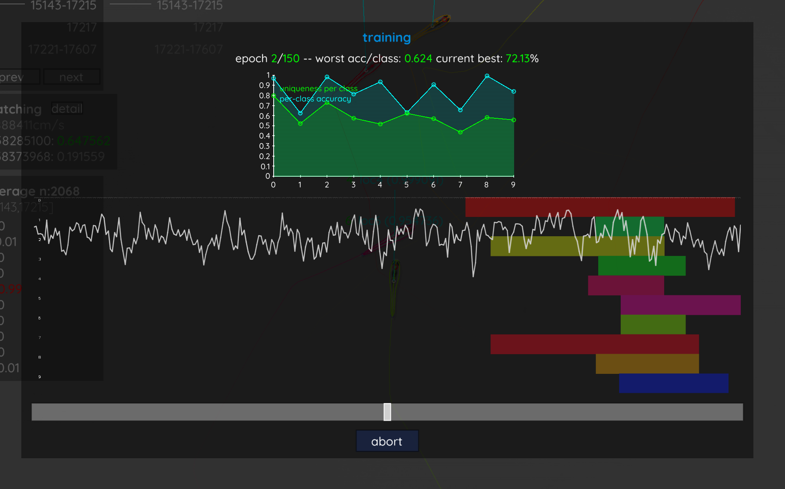
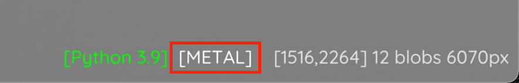

.. include:: names.rst

.. toctree::
   :maxdepth: 2

Visual Identification
=====================

This section describes general principles regarding the visual identification algorithm in |trex|.

General procedure
-----------------

The most important thing is that consecutive tracking sequences (see :ref:`Timeline` for how they are displayed) exist for each individual and are as long as possible - while avoiding misassignments. So you *can* relax parameters like :func:`track_max_speed` and :func:`blob_size_ranges` to lengthen consecutive segments, but make sure that this does not lead to **unrecognized** tracking errors. Tracking errors are generally "fine" for the identification algorithm, but evil lurks whenever identity switches occur in the *middle* of a consecutive segment - this would mean that the switch has *not* been recognized, as consecutive segments are ended whenever "risky business" is detected. So a non-detection like this hints at suboptimal tracking parameters.

.. NOTE::
   
   The current consecutive segments per individual are displayed on the top-left when the individual is selected (and when you're in tracking view, see :ref:`Keyboard shortcuts`).

   .. image:: highlight_consecutive_segments.png

You also have to set a fixed number of individuals by setting :func:`track_max_individuals` manually, or relying on the automatic detection. This value has to be either appended to the command-line, or saved in the video's settings file to be applied before the program is started.

Once you are happy with the tracking results, click on menu -> visual identification. This gives you a short description that you should probably read. Now, click "Start". Keep in mind that this will remove all previously added :func:`manual_matches` and retrack the entire video - automatically applying the generated identity predicitions.

You now have to sit back and wait, or grab a coffee, while the algorithm tries to (starting at the consecutive segment that is highlighted green in the timeline) find samples for each individual until a uniqueness of at least :func:`gpu_accepted_uniqueness` is achieved, or no more suitable segments can be found.

When training is over, the video will be retracked and now most numbers above the individuals should be green. You can also click on the display menu (bottom-left) and select "dataset". This will show the current averaged prediction values per individual and quality measurements of the current consecutive segment. Check for misassignments and adjust parameters as required. Once you're happy with your results, you can export the tracking data by pressing ``S``, or apply the same parameter settings to other videos of the same batch (menu -> save config).

Common troubles
---------------

If the training takes really long, first check if TRex is using the correct graphics card (if any). This, once visual identification is started, will be visible on the bottom right of your screen, e.g. on an Apple M1 (but note that not all GPUs sport such a Metal name):

If this is correct, but you are experincing long training times with low uniqueness values (e.g. below chance), check again for tracking mistakes. Over 90% of such errors stem from tracking mistakes.

If you are experincing long training times, but high uniqueness values, instead the cause is likely a high number of samples per individual. You can cap this by setting :func:`gpu_max_sample_gb` to a lower value (e.g. 0.5).

Another possibility is that individuals may not be visible in their entiretythe training samples. This can be adjusted by either downscaling them (:func:`recognition_image_scale`), or increasing the image size (:func:`recognition_image_size`). You can view these samples by setting :func:`recognition_save_training_images` to true before starting the training process, and then opening the generated file in e.g. Python. It is called ``<output_dir>/<videoname>_validation_samples.npz``.