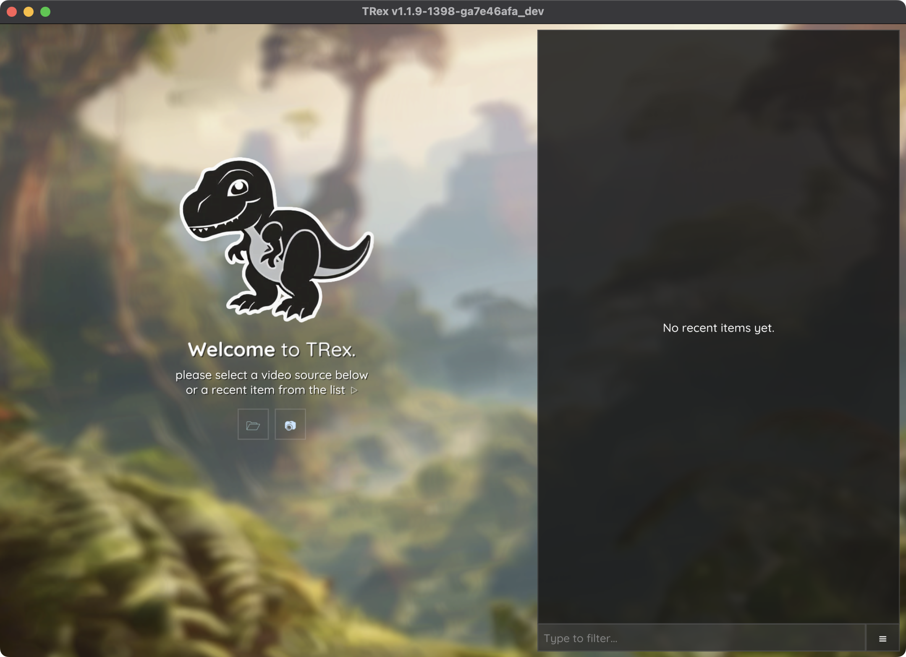

.. include:: names.rst

.. toctree::
   :maxdepth: 2

.. WARNING::
	On Windows and Linux a NVIDIA graphics-card is required for hardware accelerated machine learning. On macOS (Apple Silicone), the Metal backend is used for hardware acceleration.

Installation
############

Recommended System Requirements
-------------------------------

|trex| supports all major platforms. While |trex| is designed to be lightweight, ensuring a modern CPU, sufficient RAM (8GB or more), and a dedicated GPU (optional but beneficial for advanced machine learning tasks) can optimize performance. Our test systems cover a broad spectrum of operating systems and architectures, such as Windows, macOS, and Linux, and we recommend using a system with at least the following specifications:

- **Operating System**: Windows 10, macOS 11, or Ubuntu 20.04 LTS
- **Processor**: Intel Core i5 or AMD Ryzen 5
- **Memory**: 8GB RAM
- **Graphics** (optional but recommended): dedicated NVIDIA GPU with 2GB VRAM, or Apple Silicon's integrated GPU

This is a general recommendation, and |trex| can run on systems with lower specifications depending on the specific task at hand. However, the performance may be slower, especially for larger videos or more complex scenes. If you encounter any issues with the software that you think should not be happening, feel free to file a bug report on our `GitHub repository <https://github.com/mooch443/trex>`_.

Installation
------------

You can download the latest version of |trex| using `Miniforge` (conda). To install |trex|, you need to have `Miniforge` installed on your system.

If you're not familiar with `conda` or `Miniforge`, you can find more information on how to install them `here <https://conda-forge.org/miniforge/>`_. Miniforge is a minimal installer for `conda`, an open-source package manager that helps you create virtual environments and install software and libraries without installing them globally on your system [#f3]_. We do not support Anaconda's default channels, so please use `Miniforge` instead (in Anaconda, you can also restrict your channels to `conda-forge` only [#f4]_).

Open your `Miniforge` Prompt and run:

.. code-block:: bash

   conda create -n track -c trex-beta trex

.. NOTE::

   Installation only works if `conda-forge` is the *only* channel you have added to your `conda` configuration. By default, this is the case if you're using `Miniforge`. If added other channels manually, or you are using Anaconda, you can run the following command instead:

   .. code-block:: bash

      conda create -n track --override-channels -c trex-beta -c conda-forge trex

   If any other channels are used, the installation might not work as expected and may throw `package not found` errors. This will probably work, but we give no guarantees.

This will create a new conda environment called ``track`` with |trex| installed. This could take a while, especially during conda's 'verifying transaction' phase when it is installing additional packages via pip. Once it's done, you can activate the environment using:

.. code-block:: bash

   conda activate track

Then start |trex| by typing:

.. code-block:: bash

   trex

and pressing **Enter**. 

If a window showing a friendly T-Rex appears, you've successfully installed the software and can proceed to the next section.

.. _welcome_screen:

   The TRex graphical user interface (GUI) showing the welcome screen.

If you have any issues with the installation, please refer to the (more detailed) :doc:`installation guide <install>`.

.. [#f3] The advantage of this is that you can have different versions of the same software installed on your system without conflicts, and that they can be easily removed.

.. [#f4] We do not support Anaconda's default channels because forge has easier license agreements and is often more up-to-date. Anaconda's hosted channels can be problematic for you too, if your institution does not have a license agreement with them.

Compile it yourself
-------------------

There are two ways to get your own version of |trex|:

* creating a local conda channel, and installing from there
* running CMake/build manually with customized options

Both are obviously similar in result, but there *are* differences (the local channel is essentially a script for the manual procedure, with some caveats). For example, the conda build is limited to certain compiler and OS-SDK versions -- which is something that you may want to change in order to enable certain optimizations. There is also no straight-forward way to add options like enabling Pylon support, for which you'd have to go the manual way described after the next section. We start out here by describing the more rigid (but more automated) way using conda, followed by a description of how to do everything manually.

Local conda channel
^^^^^^^^^^^^^^^^^^^

In order to get your own (local) conda channel, all you need to do is make sure you have conda installed, as well as the ``conda-build`` package. This is a package that allows you to make your own packages locally (use ``conda deactivate``, until it says ``base`` on the left). Now you should probably create a new build environment first, keeping your base environment clean::

	conda create -n build conda-build git python pip
	conda activate build

Once this is done, you can clone the |trex| repository and change your directory to the ``trex/conda`` folder in the downloaded repository::

	git clone --recursive https://github.com/mooch443/trex
	cd trex/conda

.. NOTE::

	Please make sure that you do not have a ``bareRepository = explicit`` value in your ``~/.gitconfig`` file. This sometimes prevents proper git repository cloning using ``conda build``!

Next, make sure you have Visual Studio 2022 installed, or Xcode on macOS. Linux should work out of the box, and if not you could try to install `build-essential` first to get ``g++`` (at least version 11).

On MacOS you may need to adjust the SDK location as well as the deployment target. This can be done in the ``conda_build_config.yaml`` file - so these lines here need to be changed::

	SDKROOT:
      - /Applications/Xcode.app/Contents/Developer/Platforms/MacOSX.platform/Developer/SDKs/MacOSX15.2.sdk # [osx]

    CONDA_BUILD_SYSROOT:
      - /Applications/Xcode.app/Contents/Developer/Platforms/MacOSX.platform/Developer/SDKs/MacOSX15.2.sdk # [osx]

Change them to the correct location within your filesystem. You may also have to adapt the ``MACOSX_DEPLOYMENT_TARGET`` and SDK paths in ``build.sh``.

Finally, you can build the package using::

	conda build .

.. NOTE::
	Note that if you want to enable/disable certain features (e.g. use a locally installed OpenCV library, enable the Pylon SDK, etc.) the build script (namely ``build.sh`` or ``bld.bat`` on Windows) is the place where you can do that. You may need to add absolute paths to the cmake call (e.g. adding folders to ``CMAKE_PREFIX_PATH`` in ``build.sh``) so that it can find all your locally installed libraries -- in which case your conda package will probably not be portable.

After compilation is successful, |trex| can be installed using:

	conda create -n tracking --override-channels -c local -c conda-forge trex

Notice there is a ``-c local``, instead of the ``-c trex-beta`` for a normal installation. If this does not work, you can also put the full output folder here that conda build displayed at the end of a successful compilation. For example::

	conda create -n tracking --override-channels -c /home/user/miniforge3/conda-bld -c conda-forge trex

Finally, to run it simply switch to the environment you just created (tracking) using ``conda activate tracking`` and run ``trex`` to see if the window appears!

Compiling manually (TODO)
^^^^^^^^^^^^^^^^^^^^^^^^^

.. WARNING::
	Please note that the below instructions may not be up-to-date yet. I am working on it and will update them as soon as possible.

First, make sure that you fulfill the platform-specific requirements:

* **Windows**: Please make sure you have Visual Studio installed on your computer. It can be downloaded for free from https://visualstudio.microsoft.com. We have tested Visual Studio versions 2019 up to 2022. We are using the Anaconda PowerShell here in our examples.
* **MacOS**: Make sure you have Xcode and the Xcode compiler tools installed. They can be downloaded for free from the App Store (Xcode includes the compiler tools). We used ``macOS >=11`` and ``Xcode >=13``.
* **Linux**: You should have build-essential installed, as well as ``g++ >=11`` or a different compiler with C++23 support.

As well as the general requirements:

* **Python**: We use version ``>= 3.7,<4``.
* **CMake**: Version ``>= 3.22``.

.. NOTE::
	We will be using Miniforge here. However, it is not *required* to use Miniforge when compiling |trex| -- it is just a straight-forward way to obtain dependencies. In case you do not want to use Miniforge, please make sure that all mentioned dependencies are installed in a way that can be detected by CMake. You may also add necessary paths to the CMake command-line, such as ``-DOpenCV_DIR=/path/to/opencv`` and use switches to compile certain libraries (such as OpenCV) statically with |trex|.

The easiest way to ensure that all requirements are met, is by using conda to create a new environment::

	conda create -n trex git cmake ffmpeg pip numpy==1.26.4 python=3.11 nasm

Next, switch to the conda environment using::

	conda activate trex

You can now clone the repository and change your directory to a build folder::

	git clone --recursive https://github.com/mooch443/trex

Now run the ``post-link`` script to install some required pip packages::

	# Windows
	cd trex/conda
	post-link.bat

	# Linux or MacOS
	cd trex/conda
	sh post-link.sh

Create and switch to the build folder::

	cd ../Application
	mkdir build
	cd build

On MacOS you may need to adjust the SDK location as well as the deployment target. This can be done in the ``Application/trex_build_unix.sh`` script - there is a line that defines e.g.::

	MACOSX_DEPLOYMENT_TARGET="15.2"

Which you can change to your installed SDK version.
	
Now we have to generate the project files for the given platform and compiler. The required CMake command varies slightly depending on the operating system. Within the environment, execute the compile script for your platform::

	# Linux/MacOS	
	../trex_build_unix.sh

	# Windows (Miniforge PowerShell)
	../trex_build_windows.bat

Regarding switches, TRex offers a couple of additional options, with which you can decide to either compile libraries on your own or use existing ones in your system/environment path -- see next section.

The compile scripts will attempt to compile the software in Release mode and compile sub packages in a specific order, *since I was too lazy to make the CMakeLists work by themselves*. To compile in a different mode, let this run and then simply run ``cmake --build . --config Debug``, for example. If compilation succeeds, you should now be able to run |trex| from the command-line, within the environment selected during compilation.

.. NOTE::

	In order to compile the documentation you'll need a few more packages, installable via pip::

		python -m pip install sphinx-hoverxref sphinx-rtd-theme sphinx-rtd-dark-mode sphinx-copybutton

	Then go to the trex/docs folder and run::

		make html

	This is for HTML, but I am told sphinx supports more formats, too :)

Special needs
^^^^^^^^^^^^^

|trex| compilation using CMake offers switches to customize your build. Each of them can be appended to the above CMake command with ``-D<option>=<value>`` where ``value`` is usually either ``ON`` or ``OFF`` (unless it is a path, in which case it is a path). Below, we explain a couple of use-cases where these might come in handy -- but first, let's see a list of all CMake options available:

* **WITH_PYLON**: Activates Pylon compatibility, enabling support for machine vision cameras from Basler (using USB interfaces). We tested this with versions 5 and 6. See `Basler Pylon support`_ below.
* **WITH_FFMPEG**: Enabled by default, but can be forcibly turned off. This enables the streaming of MP4 video when recording from a camera in |grabs|. See `FFMPEG support`_.
* **TREX_BUILD_OPENCV**: If set to ``ON``, |trex| builds its own version of OpenCV with OpenCL support enabled, but otherwise limited features. Avoids using system provided binaries (or binaries in the conda environment) if enabled. See `Use an existing OpenCV distribution`_.
* **TREX_BUILD_ZIP**: Builds libzip and libz.
* **TREX_BUILD_PNG**: Builds libpng. If set to ``OFF``, then both libraries have to be provided in a way that CMake can find them.
* **TREX_BUILD_GLFW**: In order to display windows and graphics inside these windows, GLFW is required. You can use a custom build by enabling this option.
* **TREX_WITH_TESTS**: Build or don't build additional test executables.

Basler Pylon support
^^^^^^^^^^^^^^^^^^^^

In case you are planning to use |grabs| to record from Basler cameras directly, you have to compile the program with the additional option ``-DWITH_PYLON=ON``. Prior to this, you will also need to install the Basler Pylon SDK from their website at https://www.baslerweb.com/. We tested |trex| with version ``5.2.0``.
