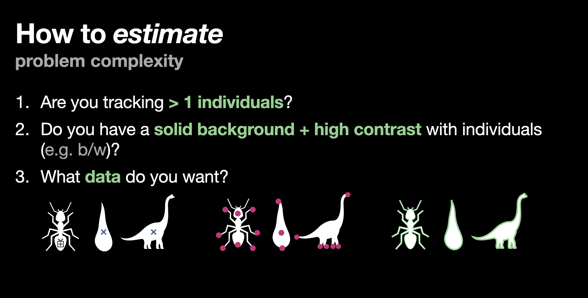
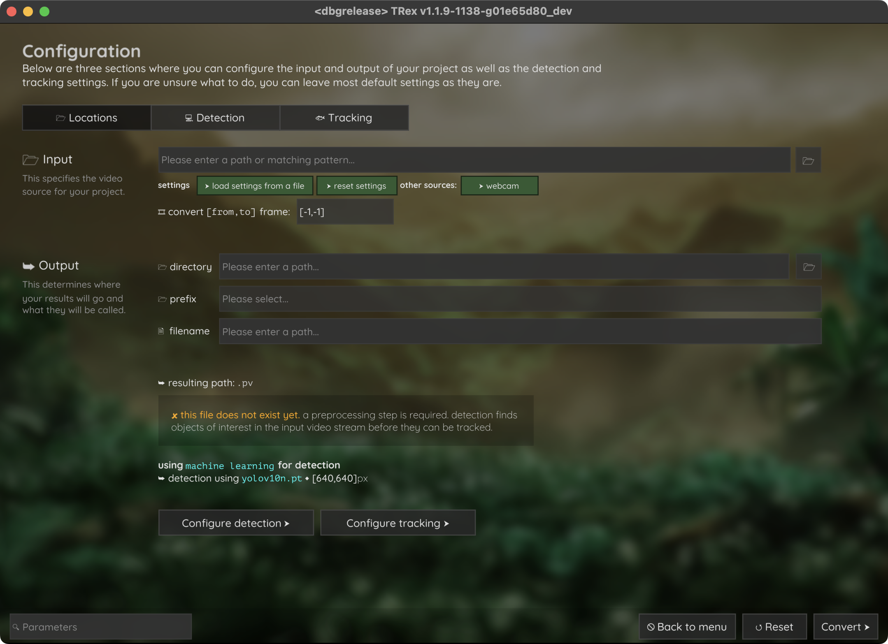
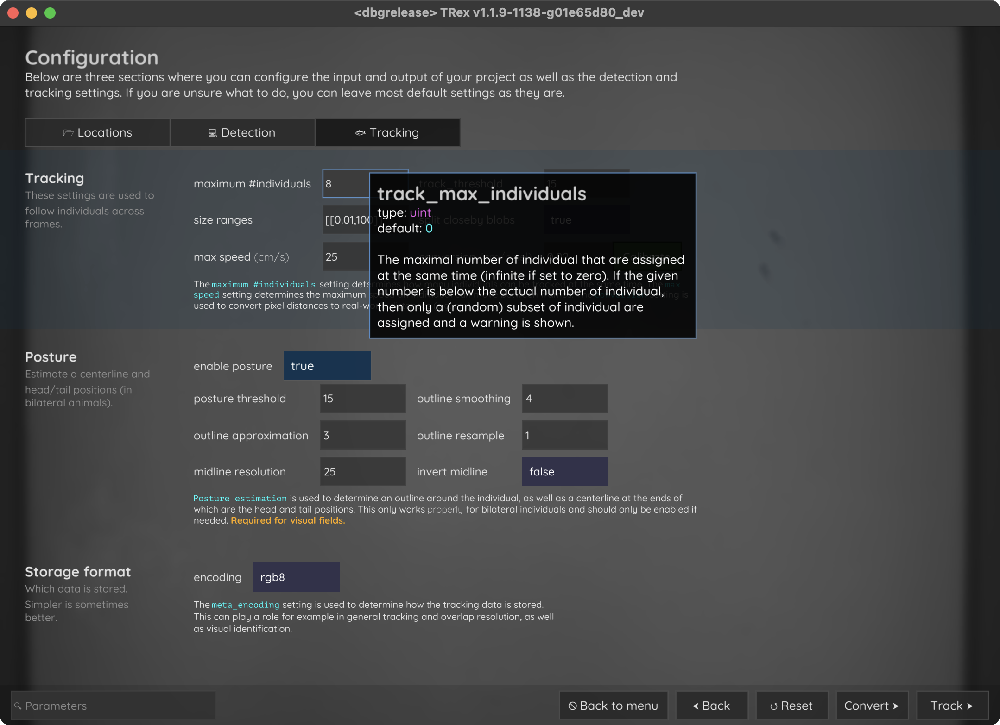

.. include:: names.rst

.. toctree::
   :maxdepth: 2

Tutorials
---------

This section contains tutorials on how to use |trex|, from setting up the software to analyzing videos and exporting data. You can follow along reading the text or watch the video tutorials on the `YouTube channel <https://www.youtube.com/@TRex-f9g>`_.

Understanding problem complexity
~~~~~~~~~~~~~~~~~~~~~~~~~~~~~~~~

Before you start analyzing videos, actually probably before you start recording them, it is important to understand the complexity of the problem you are trying to solve. This will help you to choose the right settings and methods to get the best results and can help you design your experiments keeping certain requirements in mind. The complexity of the problem can be broken down into several categories:

- **Number of individuals**: The more individuals you have in your video, the more difficult it will be to track them all [#]_. It may also limit the options you have for tracking algorithms and may require more (computational) resources. Visual identification, for example, is only possible with a limited number and (relatively) fix group of individuals.

- **Scene complexity**: The more complex the scene is, the more difficult it can be to track individuals. This includes things like occlusions, shadows, reflections, and other objects that may interfere with tracking. Varying backgrounds or visually complex backgrounds with difficult contrast may for example require more advanced segmentation algorithms [#]_.

- **Camera and lighting choice**: The camera you use can also affect the complexity of the problem. For example, a camera with a low resolution or a low frame rate may make it more difficult to identify individuals visually (e.g. if you are planning to use the visual identification algorithm). If the shutter speed is too low, you may get motion blur which can make it difficult to track them, too. Lighting conditions can also affect the quality of the video - e.g. when you have control over this aspect you should prefer DC lights instead of AC lights to avoid flickering.

- **Research question**: Always try to use the easiest approach possible to answer your research question. If you are interested in the general behavior of a group of individuals, you may not need to maintain identities perfectly. |trex| provides you with information on shorter sequences (per tracked object) that you can likely rely on for your analysis. If you do need perfectly maintained identities [#]_, you may need to use the visual identification algorithm - which costs way more time and computational power. The answer to your research question may also affect the type of data output you require. For example, if you are interested in the average speed of a group of individuals, you may only need the trajectory data, while you need pose data if you are interested in the position of specific body parts (see image below).

The following sections will guide you through increasingly difficult problems and how to solve them with |trex|.

   Different data types that can be extracted from a video (from left to right): just the centroid position, pose/keypoint data, and outline-type data including directionality (front/back).

.. [#] This is because the number of possible combinations of individuals that could be in a certain location at a certain time increases exponentially with the number of individuals. This is known as the "curse of dimensionality" and is a common problem in computer vision and machine learning. If you have a large number of individuals, you may need to use more advanced tracking algorithms or reduce the number of individuals you are tracking.

.. [#] Segmentation algorithms are used to separate the individuals from the background in the video. For example, if you are tracking fish in a tank with a white background, you may be able to use a simple thresholding algorithm to segment the fish from the background. However, if you are tracking fish in a natural environment with varying backgrounds and lighting conditions (or a moving camera), you may need to use more advanced algorithms like deep learning or machine learning to segment the fish from the background. To achieve this we generally tend to use YOLO models (at the moment).

.. [#] For example if you have a parasitised individual in a group of unparasitised individuals, or informed vs. uninformed individuals.

Basics
~~~~~~

|trex| is versatile tracking software that **can** help you solve almost all tracking problems with varying manual effort, computational power, and time. It is designed to be user-friendly and easy for general use, but also provides advanced features for more complex situations. This tutorial will guide you through the basic steps of setting up |trex|, analyzing an example video and exporting the data.

If you want to follow along exactly as described, you can download the example video from `here <https://trex.run/8guppies_20s.mp4>`_ and put it in any folder that you like to use as your root analysis folder.

Installation
^^^^^^^^^^^^

You can download the latest version of |trex| using conda with slightly varying commands based on your operating system.

.. NOTE::

  If you are not familiar with conda, you can find more information on how to install it `here <https://docs.conda.io/projects/conda/en/latest/user-guide/install/index.html>`_. We recommend using miniforge on macOS with Apple Silicon hardware and miniconda otherwise. It is a lightweight version of conda that gives you everything you need to install software and virtual enviroments and nothing more.

For Windows or Linux, you can use the following command in your Anaconda prompt:

.. code-block:: bash

    conda create -n track --override-channels -c trex-beta -c pytorch -c nvidia -c defaults trex

For MacOS (Intel), you can use the following command in your terminal:

.. code-block:: bash

    conda create -n track --override-channels -c trex-beta -c pytorch -c defaults trex

For MacOS (Apple Silicon), you can use the following command in your terminal:

.. code-block:: bash

    conda create -n track --override-channels -c trex-beta -c pytorch -c conda-forge trex

These commands will create a new conda environment called ``track`` with |trex| installed. You can activate the environment using the following command:

.. code-block:: bash

    conda activate track

You can then start |trex| by simply typing:

.. code-block:: bash

    trex

and pressing enter. First time startup can take slightly longer than normal. If this eventually opens a window showing a friendly T-Rex you have successfully installed the software.

.. raw:: html

   <figure>
       <video width="100%" loop autoplay>
           <source src="_images/intro_screen.mov" type="video/mp4">
           Your browser does not support the video tag.
       </video>
       <figcaption>The TRex graphical user interface (GUI) showing the welcome screen.</figcaption>
   </figure>

If you have any issues with the installation, please refer to the `installation guide <install>`.

Setting up a new project
^^^^^^^^^^^^^^^^^^^^^^^^

When you first start |trex|, you will see a window with a welcome message and a button to open a file or start the webcam. Click on the folder icon in the center of the screen to proceed to the initial settings screen (see :numref:`open_file`).

   Here you can choose your initial settings before the analysis starts, e.g. the input and output files, as well as various detection and tracking parameters that we deemed important enough to put here.

Click on the 📂 folder button next to the input file name at the top, or enter the path yourself (e.g. copy paste usually also works). By default, |trex| will put generated outputs in the same folder as the input file, but you may choose a different folder in the output section below.

The `prefix` (or `output_prefix`) can optionally be set too, which creates a subfolder of the given name under the output root, redirecting all new outputs here while the original .pv file stays in the root folder. This can be used to organise different sessions for the same video (e.g. trying out different settings, or separating tracking per species).

The tabs at the top allow you to switch between settings for different aspects of the processing pipeline:

1. **Locations**: Here you can set the input and output files, and related settings.
2. **Detection**: Anything related to detecting individuals (or objects) in the raw image frames. This is the first *real* step in the pipeline, and the settings here cannot effectively be changed anymore afterward.
3. **Tracking**: Anything related to tracking the detected individuals. This is the second step in the pipeline, and the settings here can be changed at any time (although it might require a re-analysis sometimes).

For now, simply opening the ``8guppies_20s.mp4`` file and clicking the `Convert` button at the bottom right would be fine. To see how settings work, though, let's first go and check out the `Tracking` tab - set the number of individuals to 8 (since we already know this information).

   The tracking settings tab allows you to set the number of individuals to track, as well as other tracking-related settings. You can see I set a few other settings here too - feel free to read their documentation by highlighting them with your mouse.