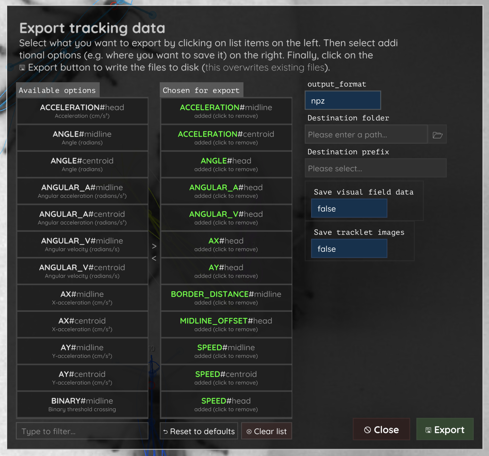
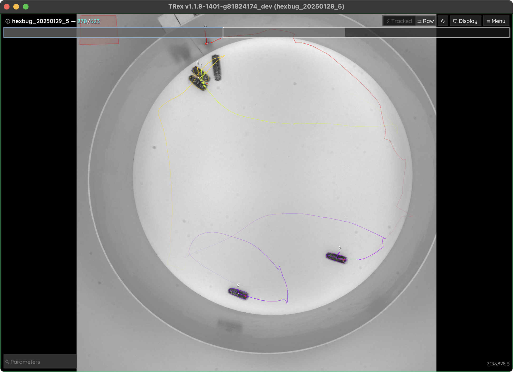
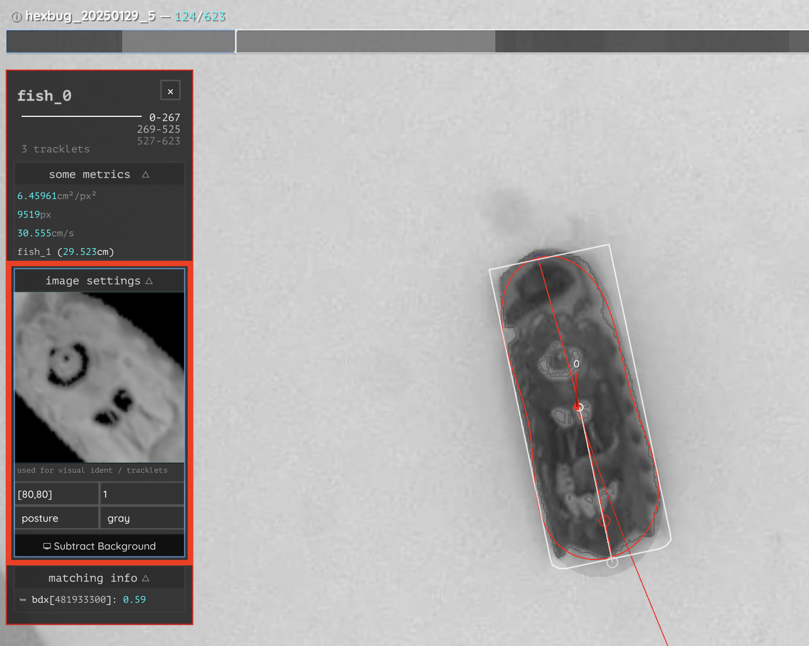

.. include:: names.rst

.. toctree::
   :maxdepth: 3
   :numbered:

Tutorials
=========

|trex| is a versatile tracking software that can help you solve a wide range of tracking problems efficiently, minimizing manual effort, computational power, and time. It's designed to be user-friendly for general use but also provides advanced features for more complex situations. This section provides tutorials on how to use |trex|, from setting up the software to analyzing videos and exporting data. 

You can follow along by reading the text or watching the video tutorials on the `YouTube channel <https://www.youtube.com/@TRex-f9g>`_.

Understanding Computational Complexity
--------------------------------------

If you are just planning to design your experiment or are new to tracking, it's essential to understand the technical implications of the specific data you're seeking. This can help you set realistic expectations and design your experiment accordingly.

Here are a few key factors we usually think about first:

1. **Number of Individuals**
   
   .. epigraph::

      *More individuals multiply tracking complexity.*

   Tracking more individuals in your video increases difficulty in many ways and the computational resources required, potentially also limiting your analysis options later [#f1]_. For example: Automatic visual identification is only feasible with smaller groups (typically fewer than 50 individuals) since it relies on relative visual differences in a *known* group. If it is not possible to automatically maintain perfect identities in too large a group, you may need to limit your analysis to more general information about the group's behavior rather than real identities. |trex| also subdivides trajectories into *tracklets*, which are shorter sequences per tracked object where identities are maintained with high confidence (see below). These can be used for more short-term analyses, even if the full video is too complex to maintain identities throughout.

2. **Scene Complexity**
   
   .. epigraph::

      *Eliminate visual clutter — use uniform, high-contrast backgrounds if possible.*

   Complex scenes make it difficult to see individuals. This does not just apply to human eyes, but also to computer vision. Various factors such as very small objects, heterochrome objects, occlusions, shadows, reflections, and other interfering objects can hinder detection (and thus tracking) performance. Varying or visually complex backgrounds with challenging contrast may require more advanced segmentation algorithms, often based on machine learning [#f2]_. These are more generic and often *better*, generally speaking, but require more manual labor to set up and more computational resources to apply. 

3. **Camera and Lighting Choice**

   .. epigraph::

      *Pay attention to your camera settings and their influence on visual quality. Do not store more data than you need (e.g., zoom in).*

   The camera and recording settings you use affect image and computational complexity. Low-resolution or low frame rate cameras may make it difficult to identify individuals visually — especially if you plan to use the visual identification algorithm. A slow shutter speed can introduce motion blur, complicating tracking efforts. Lighting conditions also play a significant role; when possible, prefer DC lights over AC lights to avoid flickering. Shiny fur or scales can also cause reflections that interfere with visual identification algorithms. High frame rates can prolong analyses since there are simply more images to process. Do not record more data than you need - zoom in if possible, and record only the area of interest. Point the camera straight down to avoid distortion and ensure that the camera is stable to avoid shaking.

4. **Research Question**

   .. epigraph::

      *Define what kind of data you need, and what it implies for your setup, before you start filming.*
   
   Aim to use the simplest approach that effectively answers your research question. If you're interested in the general behavior of a group, maintaining perfect identities may not be necessary. |trex| provides information on *tracklets*, which, as mentioned above, often suffice - even without identity corrections. For instance, if you're interested in the average speed of a group or average speed of individuals in a certain area, then short *tracklets* are enough. However, if you are distinguishing between specific individuals (*sick*/*healthy* or *informed*/*uninformed*), you might need to use the visual identification algorithm. This, if successful, gives you a stronger guarantee for maintained identities, but requires you to invest more time and computational power.
   
   Your research question also influences the *type* of data output you need - most of the time the centroid position is enough (simply called *detection*), but there are other types: *Pose*/*Keypoint* data is only necessary if you're focusing on specific body parts (see :numref:`data_types`) in any way, and *outline* data is necessary if you're interested in the directionality of the individuals (e.g., front/back) or other aspects of their 2D shape. See also [#f2]_ and :numref:`data_types` for more information.

The following sections will guide you through increasingly complex problems and how to solve them with |trex|. Identify which category your research question falls into to find the right tools.

.. [#f1] The number of possible combinations of individuals at any given time increases exponentially with the number of individuals — a phenomenon known as the "curse of dimensionality" in computer vision and machine learning. With a large number of individuals, you may need to wait a bit longer, and potentially have more visual overlaps between individuals.

.. [#f2] Segmentation algorithms are used to fully separate individuals from the background in a video - meaning not just *position* but also a *"picture"*. Keypoint data, for example, sometimes only retrieves multiple points - not the actual shape. For complex scenes, advanced algorithms like deep learning models (e.g., YOLO) are often employed.

.. _data_types:

.. figure:: images/data_types.png

   Different data types that can be extracted from a video: just the centroid position, pose/keypoint data, and outline-type data including directionality (front/back).

Recommended System Requirements
-------------------------------

While |trex| is designed to be lightweight, ensuring a modern CPU, sufficient RAM (8GB or more), and a dedicated GPU (optional but beneficial for advanced machine learning tasks) can optimize performance. Our test systems cover a broad spectrum of operating systems and architectures, such as Windows, macOS, and Linux, and we recommend using a system with at least the following specifications:

- **Operating System**: Windows 10, macOS 10.15, or Ubuntu 20.04 LTS
- **Processor**: Intel Core i5 or AMD Ryzen 5
- **Memory**: 8GB RAM
- **Graphics** (optional but recommended): dedicated NVIDIA GPU with 2GB VRAM, or Apple Silicon's integrated GPU

This is a general recommendation, and |trex| can run on systems with lower specifications depending on the specific task at hand. However, the performance may be slower, especially for larger videos or more complex scenes. If you encounter any issues with the software that you think should not be happening, feel free to file a bug report on our `GitHub repository <https://github.com/mooch443/trex>`_.

Installation
------------

You can download the latest version of |trex| using `Miniforge` (conda). To install |trex|, you need to have `Miniforge` installed on your system.

If you're not familiar with `conda` or `Miniforge`, you can find more information on how to install them `here <https://conda-forge.org/miniforge/>`_. Miniforge is a minimal installer for `conda`, an open-source package manager that helps you create virtual environments and install software and libraries without installing them globally on your system [#f3]_. We do not support Anaconda's default channels, so please use `Miniforge` instead (in Anaconda, you can also restrict your channels to `conda-forge` only [#f4]_).

Open your `Miniforge` Prompt and run:

.. code-block:: bash

   conda create -n track -c trex-beta trex

.. NOTE::

   This only works if `conda-forge` is the *only* channel you have added to your `conda` configuration. By default, this is the case if you're using `Miniforge`. If added other channels manually, or you are using Anaconda, you can run the following command instead:

   .. code-block:: bash

      conda create -n track --override-channels -c trex-beta -c conda-forge trex

   If any other channels are used, the installation might not work as expected and may throw `package not found` errors. This will probably work, but we give no guarantees.

This will create a new conda environment called ``track`` with |trex| installed. This could take a while, especially during conda's 'verifying transaction' phase when it is installing additional packages via pip. Once it's done, you can activate the environment using:

.. code-block:: bash

   conda activate track

Then start |trex| by typing:

.. code-block:: bash

   trex

and pressing **Enter**. 

If a window showing a friendly T-Rex appears, you've successfully installed the software and can proceed to the next section.

.. _welcome_screen:

.. figure:: images/welcome_screen.png
   :width: 100%

   The TRex graphical user interface (GUI) showing the welcome screen.

If you have any issues with the installation, please refer to the (more detailed) :doc:`installation guide <install>`.

.. [#f3] The advantage of this is that you can have different versions of the same software installed on your system without conflicts, and that they can be easily removed.

.. [#f4] We do not support Anaconda's default channels because forge has easier license agreements and is often more up-to-date. Anaconda's hosted channels can be problematic for you too, if your institution does not have a license agreement with them.

Workflow & Quick Start
^^^^^^^^^^^^^^^^^^^^^^

The general workflow of using |trex| is quite straight-forward. Usually, you'd have your videos already recorded and will simply

1. Open |trex|
2. Open the video file, change a few settings and click **Convert**
3. Wait a bit until you're dropped into **Tracking View**
4. Quickly check for mistakes and, if OK, export the data by pressing ``S``

To improve tracking performance, the software will produce a *cached* version of your video file (``.pv``) that contains all the information needed, but not more. This includes all objects of interest (i.e. not the background per frame) as well as a single averaged background image.

.. admonition:: On Video Files and File Sizes

   Standard encoded video files, such as `.mp4`, can often be surprisingly difficult to scrub through - you may have noticed this, for example, as `delays` when trying to rewind or fast-forward a movie you're watching. |trex| *preprocessed* video files are designed to make scrubbing faster by avoiding *delta encoding* (i.e. storing only the changes between frames). Instead, all objects of interest in every frame are stored in full - omitting all background pixels. This enables seamless jumps (e.g. during `4x` playback) and fast random data access during tracking. On the downside, this approach can sometimes result in slightly larger file sizes compared to the original `.mp4` — though this depends on your specific situation and is not always the case.

   The file size of a |trex| video also depends on your settings. For instance, the :param:`meta_encoding` parameter determines whether all RGB channels are stored, only greyscale, or none at all (resulting in much smaller files). Refer to the documentation for more details on these options.

   If you're running out of storage space, you can delete the .pv file and reconvert the video later using the settings you previously saved.

Parameters
^^^^^^^^^^

Something you'll have to get used to is :doc:`parameters <parameters_trex>`. These are the settings that you can adjust to optimize results for your specific video [#f5]_. There are many parameters in |trex|, as is unfortunately very typical for science software projects, but luckily only *very few* will typically be of relevance.

Usually their names and prefixes will be descriptive and easy to understand or search for. Prefixes typically correspond to the "phase" they're being used in, such as ``detect_*`` for detection and ``track_*`` for tracking, or the specific task they belong to (such as ``output_*``). Here are a few examples:

- **detect_type**: The type of detection algorithm used (e.g., background subtraction or YOLO).
- **detect_threshold** (only for background subtraction): The minimum greyscale intensity value for a pixel to be considered part of an individual.
- **detect_size_filter**: The minimum and maximum size of objects extracted in the detection phase.
- **track_threshold** (only for background subtraction): The minimum greyscale intensity value for a pixel to be considered part of an individual during tracking. This can be changed freely at any time, as its non-destructive. :param:`detect_threshold`, which *is* destructive, can be understood as a lower limit for :param:`track_threshold`.
- **track_max_speed**: The maximum speed an individual can move per second.
- **track_size_filter**: The minimum and maximum size of individuals.

There are many more parameters you can adjust to optimize  detection and tracking for your specific video. You can find a full list of parameters and their descriptions in the :doc:`parameters_trex`. Also have a look at :ref:`parameter-order` to understand the order in which parameters are applied.

.. [#f5] They are also used internally for many things, like showing/hiding elements of the user-interface and storing the currently shown frame or selected individuals. This can also help you customize your user experience by putting them in a settings file or the command-line!

Tutorial: Basics
----------------

This tutorial will guide you through the basic steps of setting up |trex|, analyzing an example video, and exporting the data.

If you want to follow along exactly as described, you can download the example video from `here <https://trex.run/8guppies_20s.mp4>`_ and place it in any folder you'd like to use as your root analysis folder.

Setting Up a New Project
^^^^^^^^^^^^^^^^^^^^^^^^

When you first start |trex|, you'll see a window with a welcome message and a button to open a file or start the webcam. Click on the folder icon in the center of the screen to proceed to the :ref:`initial settings screen <initialsettings>`.

There are a few tabs on top of your screen now (see :numref:`initialsettings`). You will be landed on the first one:

- **Locations**: Set the input and output files and related settings.
- **Detection**: Configure settings related to detecting individuals (or objects) in the raw image frames. This is the first real step in the pipeline, and settings here cannot be effectively changed afterward.
- **Tracking**: Adjust settings related to tracking the detected individuals. This is the second step in the pipeline, and settings here can be changed at any time, although it might require re-analysis.

.. _initialsettings:

   Initial settings screen where you can choose your input and output files, as well as various detection and tracking parameters.

Let's set an input file first and then go through a few more steps to get started:

1. **Select the Input File**: Click on the 📂 folder button next to the input file name at the top, or enter the path manually. Once you selected the video, the background of the dialog will change to a slowed down and slightly blurry version of it (you can hover it to see it more clearly). 
   
   .. NOTE::

      To follow along with the tutorial you can download the ``hexbug_20250129_5.mp4`` file from `here <https://edmond.mpg.de/dataset.xhtml?persistentId=doi:10.17617/3.7F5MGE>`_ and select it here.

2. **Setting Output Preferences** (optional):

   By default, |trex| will place generated outputs in the same folder as the input file, but you can choose a different folder in the output section below.

   - **Output Folder**: You can choose where to save the output files by clicking on the 📂 folder button next to the output file name. By default, |trex| saves the output files in the same folder as the input file.
   - **Prefix**: The ``prefix`` (or ``output_prefix``) can be optionally set. This creates a subfolder with the given name under the output root, redirecting all new outputs there while the original ``.pv`` file stays in the root folder. This helps organize different sessions for the same video (e.g., trying out different settings or separating tracking per species).

3. **Set the detection type**:

   Tracking can generally be defined as connecting the dots between detections across the temporal dimension. The first step in this process is detecting the individuals in each frame. |trex|, at the moment, offers two different detection types:

   - **Background subtraction**: This is the fastest detection type and works well for most videos recorded in *controlled conditions*. It's based on the difference between the current frame and a background image. This background is built from uniformly sampled frames of the video - e.g. by averaging them - getting rid of the moving entities. It's a simple and fast method that works well for most videos.
   - **YOLO** (*default*): This is a more advanced detection type that uses a deep learning model (e.g., YOLO architecture) to detect individuals. These models are better at handling complex scenes, but are also slower and need more computational power. They are recommended for videos with complex backgrounds/low foreground to background contrast, complicated occlusions, or other challenging conditions. If the default models (trained on e.g. human-pose or everyday objects) are not sufficient, you can also train your own model (see :doc:`model_training`).

   For this tutorial, we'll use the default *background subtraction* method. However, YOLO is selected by default - please navigate to the **Detection** tab to fix that. In the same tab we can also change the :param:`detect_threshold` value, which is the minimum greyscale intensity value ``[0-255]`` for a pixel to be considered part of an individual. The default value is ``15``, but you can adjust it to better fit your video: in our case we'll go with ``50``. Unlike :param:`track_threshold`, this value acts *destructively* and could actually be regarded as a lower bound for :param:`track_threshold`.
   
   We will check back on thresholds later.

4. **Set the Number of Individuals**:

   - Navigate to the **Tracking** tab.
   - We counted the individuals when we recorded the video, so we should specify that number here: set the *maximum* number of individuals to ``5``. 
     
   It's called a *maximum* number because in some frames (e.g., during overlap or occlusion) the software might not be able to detect all individuals - or more objects are detected than there are individuals in the scene. This is a common problem in tracking and not specific to |trex|. The software will try to resolve this by, for example, splitting objects, but it's not always possible to get it right. If you set the maximum number too low you might lose individuals in the analysis. If you set it too high, you might get more overdetection. The software will try to resolve this as best as it can, but it's always a good idea to check the results visually.

   .. _settings_pane:

   .. figure:: images/tracking_settings.png
      :width: 100%

      The tracking settings tab allows you to set the number of individuals to track, as well as other tracking-related settings.

5. **Set further tracking settings**:

   - :param:`track_threshold` we can set to `80`, but if we change our minds later on, we can decrease this after conversion down to the value of :param:`detect_threshold` (which we set to `50` earlier).
   - :param:`calculate_posture` make sure we are calculating posture by turning this on
   - :param:`cm_per_pixel` is the conversion factor for any pixel to cm conversion (and vice-versa). You can either set this to `0.0257` now because you magically know this number - or you can click on "Calibrate". This gets you to this screen here:

   .. _calibrate_view:

   .. figure:: images/calibrate_view.png
      :width: 100%

      Click on two points here to draw the line, then click on "configure" to set the actual length of this line in the real world. In this example, the floor of the arena is approximately `60cm` wide. |trex| will use this information to calculate a conversion factor to be used for all spatial units. Be sure to also accept changes to the other parameters once you click on "Okay"! This will automatically adapt :param:`track_max_speed` (and similar) for the new conversion factor (maximum speed is given in cm).

   - :param:`track_max_speed` can be set to ``100`` since the individuals are moving quite fast! This essentially means that at ``100cm/s`` we don't believe them anymore. 
   - At the very bottom, set :param:`meta_encoding` to ``gray`` instead of ``rgb8`` because we know this video is actually grayscale, so we don't generate redundant Red Green and Blue values (which are going to be indentical).

   .. NOTE::

      If you set the maximum speed *before* calibrating, obviously this number will change its meaning!

6. **Start the Conversion**:

  Once you're happy with how you've configured the settings, click the **Convert** button at the bottom right to begin processing. On most computers this will be done relatively quickly, but it can take longer for larger videos or more complex scenes. After conversion is done, you'll be dropped into the default :ref:`Tracking View <tracking_view>`.

Now the results don't look perfect yet. It is fairly normal to have to adjust the settings a few times to get the best results. Anything related to tracking can be changed at any time, but detection settings are fixed once the conversion starts. So if you're not happy with the initial **Detection**, you can always cancel an ongoing conversion, go back to the opening dialog and try again. **Tracking problems**, on the other hand, can be resolved more easily later on; the only requirement is that the detection is good enough to start with - meaning no individuals are completely undetected or deformed by irreversible settings such as the :param:`detect_threshold` mentioned earlier.

.. epigraph::

   **Tip:** Feel free to explore other settings either here (:doc:`parameters_trex`) or inside the app. Simply hover over any setting with your mouse to read its documentation and understand how it affects the analysis.

.. _graphical_interface:

The Graphical Interface
^^^^^^^^^^^^^^^^^^^^^^^

Before we jump into adjusting a few more parameters, there are a few elements of the graphical user-interface (**GUI**) that are important to understand:

- **Top Bar**: This is where you can find the main menu, which includes options to open a new file, save the current configuration, and close the file. You can also find the **Reanalyse** button here, which allows you to retrack the video with the current settings.

   .. figure:: images/top_menu.png
      :width: 100%

      The main menu bar. You can find many important options here - click through it to explore. The buttons on the left switch between **Tracking View** and **Raw View** (key ``D``) for example!

- **Timeline**: This is where you can scrub through the video to see the tracking results. You can click on the timeline to jump to a specific frame, or drag across it to scrub through the video. You can also use the arrow keys to move frame by frame.

   .. figure:: images/timeline.png
      :width: 100%

      Click and hold here to scrub through the video (or use your arrow keys). It will show you information about each frame and offer to reanalyse from specific frames when you hover them.

- **Parameter Combobox**: Here you can find and change parameters by simply starting to type terms, using the auto-complete feature to find the right one. You can also use the arrow keys to navigate through the list and Enter to select.

   .. figure:: images/parameter_dropdown.png
      :width: 100%

      The parameter box. You can just type words into it, separated by spaces, to search - hover the filtered parameters to reveal additional documentation.

- **Info Card**: This is displayed on the top-left of the screen if an individual has been selected. It shows you information about its :ref:`tracklets`, kinematics, and image settings. You can click on the tracklet numbers to jump to the start of a tracklet, or press the ``C`` and ``V`` keys to jump to the previous and next tracklet, respectively.
  
   .. _tracklets_infocard:

   .. figure:: images/tracklets_infocard.png
      :width: 100%

      The list of tracklets for the current individual. You can hover each tracklet to reveal the reason that it was terminated.

- **Tracking View** (see :numref:`tracking_view`): This is where you can see the video with the *tracked* individuals highlighted. This is the view you want to be in whenever you want to confirm tracking quality, or to explore the data. Press ``D`` to toggle between **Tracking View** and **Raw View**, or use the buttons in the **Top Bar**. You will likely spend most of your time here!
- **Raw View** (see :numref:`reassign_identity`): This is where you can see the raw detections in each frame. You can click on the center points of the objects to assign a certain individual identity to them. |trex| will automatically start retracking from the current frame on, so always go in chronological order. You can then press the ``D`` key again to switch back to the **Tracking View** and review the changes you've made.

There are also some dialogs - for example the **Export Dialog**:

   The **Export Dialog** is opened when you press ``S`` on your keyboard or click on **☰ Menu** → **Export data**.

Here you can select available options on the left by clicking on them, which moves them to the right - that means if you either press ``S`` again, or click on **Export** (bottom-right), they will be saved to npz/csv files, according to your options.

.. _optimizations:

Parameter Optimizations
^^^^^^^^^^^^^^^^^^^^^^^

The tracking results are not perfect yet, as you may be able to spot in :numref:`tracking_view` fairly easily.

There are two ways of changing parameters:

1. Adjusting parameters and then reconverting the entire video. This is can be quite time-consuming for larger videos. For detection-related parameters there is no way around it, but when it comes to tracking parameters you can ...
2. ... adjust parameters on-the-fly and see the results immediately from within the graphical tracking view of |trex|.

The general intuition here is that if your parameter of choice applies during the tracking phase (i.e. anything that is not detection-related), you can change its value at any time. You may have to **reanalyse** to see the changes, but this is usually a lot faster than reconverting the entire video. Detection parameters, on the other hand, are fixed once the conversion starts, so you'll have to cancel the conversion and start over if you're not happy with the results. 

If our detection parameters (i.e. :param:`detect_threshold`) were the issue here, we'd have to reconvert the video. To do that we'd first go back to the welcome screen. You can do that by clicking on the **☰ Menu** button in the top right corner of the screen, then → **Close file**. There, you should see the video now as one of the "Recent files". Click on it to open the settings dialog again. You can then adjust all the parameters you like and click on **Convert** again + agree to overwrite the existing file.

.. warning::

   Reconverting overwrites the existing video cache (.pv), but it will **not** automatically overwrite the settings file it generated the first time. This means that your adjusted settings are not gonna be around next time you click on the guppy video unless, after being dropped into tracking view, you do **☰ Menu** → **Save Config** to overwrite it manually.

However, we're fine on that I think, so let's continue with the tracking parameters now. In tracking view, you'll notice that not all individuals are tracked while some of the randomly floating particles are! Luckily, we can fix this rather easily by adjusting :param:`track_size_filter` - but what are the correct values here? 

Go to frame ``270``. We can already tell that there's a bunch of problems here: some parts of the wall are tracked, some individuals aren't (despite being separated and visible). Let's fix this by excluding unreasonably sized objects.

.. _tracking_view:

   The tracking view shows the video with the detected individuals highlighted. You can adjust the tracking settings here to improve the results. You may have already spotted some problems here, but don't worry - we'll fix them now.

Press the ``D`` key, or alternatively click on **Raw** on the top-right, to switch to the **Raw view**. This view shows you the raw detections in each frame, and you can see the size of each detection when you hover it. Hover some of the individuals and particles, and you'll quickly see that all of the individuals are around a size of ``5-7`` pixels, while the particles are much smaller. 

We can use this information to filter out unwanted particles and reflections by setting the :param:`track_size_filter` to ``[4,10]``. Typically, the lower bound should be a bit below the smallest individual size, and the upper bound a bit above the largest individual size. This will filter out most of the particles, but keep the individuals.

Now press ``D`` again to switch back to tracking view. Nothing has been applied yet, so click on **🔄 Reanalyse** on the top-right to apply your changes by retracking the video.

Scrub through the video by clicking on (or dragging across) the timeline at the top. Tracking should be nice now! At this point you could already press ``S`` to export what you have and use it elsewhere. We will be going for a few more optimizations, though.

.. NOTE::

   Note that sometimes the background video can lag behind slightly while scrubbing around (not so much the tracked objects, though). This does not affect analysis of course. In fact, |trex| does not use the original video anymore at this point and showing it is simply a visual aid.

.. _tracklets:

Tracklets
^^^^^^^^^

A bit more important background knowledge: Tracking in |trex| heavily relies on consecutively tracked trajectory pieces - the so called *tracklets* - for multiple reasons. Before we continue, let's have a quick look at them so we know what we're aiming for when changing parameters.

.. epigraph::

   **Generally speaking, "tracklets" are short sequences of consecutive detections for a single individual.**
   
Within this sequence of frames, based on basic kinematics, we can be confident that the same physical individual is being tracked continuously. If |trex| is not confident, it terminates the tracklet and starts a new one. It's important to emphasize the word *confident* here: almost every tracking software will be 100% sure that if an individual disappears for a couple of frames, a trajectory piece ends (although some will definitely interpolate by default). We are, however, also looking at cases where speeds are suspiciously high, or where multiple individuals are expected in the vicinity of too few available objects. The advantage of this is that we are *even more conservative* so we can, for example, use the tracklets as a baseline truth for :ref:`visual_identification` (see below).

You can find them, as numbers in the format ``start-end``, in |trex| by selecting an individual and looking at the **Info Card** on the top-left (see :numref:`tracklets_image`). You can click on any of them to jump to the start of the tracklet, or press the ``C`` / ``V`` keys to jump to the previous / next. You can also hover the numbers to discover why each tracklet has been terminated.

.. _tracklets_image:

   The tracklets view shows the trajectory pieces for a selected individual. You can see the start and end frames, with the current tracklet marked by a line.

Tracklets should *legitimately* end in these situations:

	- the selected individual cannot be found in a frame (e.g., because it has moved farther than :param:`track_max_speed`)
	- the selected individual has not moved too far, but close to too far (90% of :param:`track_max_speed`) so we don't trust it (the individual will still be tracked, but the tracklet ends to be sure)
	- multiple individuals were expected in the vicinity of too few available objects and cannot be separated via thresholding, so it'd rather not track anything to be sure (e.g., when individuals overlap)
	- it has actually disappeared (e.g., out of frame or in a hiding spot)

Pay attention to this when checking whether the tracking is good. If tracklets terminate for other reasons then you can likely assume that some parameters need to be changed. See :ref:`parameter-order` for more information.

Correcting Tracking Mistakes
----------------------------

While the results look pretty nice already, basic tracking does not give you any guarantees on correctness of persistent identities. This is because there are many things that can happen in a video that make *perfect* tracking (without extra identity information) impossible, even with a *perfect* tracking algorithm; so this is entirely independent of the algorithm or program used. There are many examples (see also :numref:`reasons_lost`), some of which are:

- **Overlaps**: Individuals may overlap for prolonged periods of time - this makes it impossible (without additional sources of information, such as "personally knowing the identity of individuals") to tell who is who after they separate again.
- **Obscured vision**: The camera might not be able to see the individuals for some time, potentially even multiple individuals at the same time. They might also be out of frame for a bit or merge with the background.
- **Speed bursts**: Sometimes the individuals move faster than the camera frame rate, which would make it impossible to know who went where in some situations.

Often, basic tracking with imperfect identities suffices. |trex| saves the start and end time-point for each uninterrupted sequence (**tracklet**) so that you can utilise these shorter sequences to, for example, measure speed within a certain part of the arena. Important to note here is that all tracklets overlapping in time are almost definitely *not* the same individual - a fact also used by the :doc:`identification` algorithm (see below).

.. _reasons_lost:

   Tracklets are short sequences of consecutive detections for a single individual. They are used to maintain identities across the video, but can be interrupted by various factors such as overlaps, obscured vision, or speed bursts. The reasons displayed here are *good* reasons for tracklets to end. If you find your tracklets end randomly or for other reasons, you might need to adjust your parameters.

However, if you do need a stronger guarantee on identities (and really only if you do, because this is usually time-intensive), you can consider two options:

  - **Manual correction**: You can manually correct the tracking by selecting an individual and dragging it to the correct position. This is a bit tedious, but it can be done in the tracking view. You can also use the ``C`` and ``V`` keys to jump to the previous and next tracklet, respectively. This is a good way to correct small mistakes, but it can be time-consuming for larger videos or more complex scenes.
  - **Visual Identification** (see also :doc:`identification` for more detail): This basically tries to automatically become an expert on visually differentiating between the individuals of a fixed group and uses only individual images, no time-series. It does not require much manual input but has a few preconditions (e.g., a fixed group size, visually differentiable individuals).

Correcting Manually
^^^^^^^^^^^^^^^^^^^

Going through the video manually might sound more tedious at first than it really is. This is because |trex| is designed to make it a bit easier for you: for example, you can use the ``N`` and ``M`` keys to jump to the previous and next end of a tracklet, respectively. This is a good way to find small mistakes quickly, skipping over boring sequences (which is usually 90% of the video), but without accidentally skipping important parts. These important parts are typically individuals being lost due to overlapping, out-of-view, or very high frame-to-frame speeds. You can then use the arrow keys to go back and forth in smaller steps, in case you need to check a few frames more closely.

.. _reassign_identity:

.. figure:: images/reassign_identity.png
   :width: 100%

   After clicking on an objects center point, this menu will pop up offering you the various options for assignment. These are all the known identities at the time, followed (and sorted) by the distance to the current object. Usually the identity you want to assign was also last seen close to the object it should be assigned to - in this case ``fish2`` is the one to the right.

Once you've made your determination and want to reassign a certain identity, press the ``D`` key to switch to the **Raw view**. Here you can click on the center points of each object to assign a certain individual identity to it. |trex| will automatically start retracking from the current frame on, so always go in chronological order. You can then press the ``D`` key again to switch back to the **Tracking view** and review the changes you've made. 

Note that changes to one individual can always also affect other assignments, due to how the tracking algorithm prioritizes available information:

  1. Manual assignments
  2. Automatic Visual Identification assignments
  3. Tracking probability (based on time-since-last-seen, speed, etc.)

This is fairly obviously the case when you assign an individual to a tracklet that was previously assigned to another individual - now you also changed that other individuals' trajectory for the future. This is why it's always a good idea to go through the video in chronological order, and to always check the results after you've made a change.

Finally, after you've made all of your corrections, you can press the ``S`` key to save the changes and export the data. Do not forget to also save the configuration whenever you changed something important - this can be done in the **☰ Menu** → **Save config**.

.. _visual_identification:

Automatic Visual Identification
^^^^^^^^^^^^^^^^^^^^^^^^^^^^^^^

Manual labor is always nice to avoid, but it's even better if it's not required: if you have a fixed group of individuals that are visually differentiable, and many videos to analyze, you might want to consider using the automatic **Visual Identification** (or **VI**) algorithm. This is a more advanced feature that can help you maintain identities across the entire video, without user intervention. Using it is often rather compute- and time-intensive, but so is manual labor - and with VI you do not have to be present for it. You could even use it to compare to your manual corrections to find human mistakes!

There are a few preconditions, and related settings to pay attention to, namely:

 - **Visual differences**: The individuals have to be visually differentiable. This is a bit of a vague term, but it basically means that the algorithm (best case also you) has to be able to tell them apart. This is not always easy, it's not always possible, and it's not magic. If you have a group of individuals that are visually/genetically identical, you might run into trouble and may have to resort to making manual corrections.
 - **Known group size**: We need to know how many individuals there are, otherwise we don't know what to search for. Practically, this means that you'll have to define :param:`track_max_individuals` before tracking (as we did above).
 - **Baseline truth**: All individuals of the group have to be present at the same time at least once. This is also called a *global tracklet*. It is one of the preconditions because we need at least one example of each individual to know what it looks like. The VI algorithm then tries to systematically add more examples of each individual, starting the search within the "longest global tracklet" and then going on to look at shorter ones. If all individuals are visible and separate at the same time, we know that at least in this frame the identities are unique. This is the baseline truth [#f7]_. Actually, we can also utilize each individual tracklet intersecting with this global tracklet, not only the parts that are contained within it. Global tracklets are displayed as colorful bars in the timeline as long as the number of individuals is defined (see :numref:`image_settings`). If there are none, you might either have miscounted, the individuals were not all visible at the same time, or there are other issues with tracking.

You may also need to setup the :param:`individual_image_size` and :param:`individual_image_scale`, in case the default values don't fit your particular situation - it's a good idea to check beforehand: Select an individual, unfold the :ref:`image settings <image_settings>` in the **Info Card** on the top-left, and adjusting the values there. You can let the video play to see the individual move and bend, and adjust the settings accordingly in realtime. By default, these images are normalized based on posture, but you can also choose to use the raw images or *moments* if you prefer. Try selecting different ones to observe the changes (see also :numref:`normalization_types`). If posture isn't available (:param:`calculate_posture`) then *moments* will be used by default.

.. _image_settings:

   The image settings allow you to adjust the size and scaling factor of the individual images used for visual identification (and some other features, such as tracklet images).

Finally, to start the training process in our example, simply click on **☰ Menu** → **Train visual identification**. It will guide you through a few dialogs to define what you want to do and then start learning. In case it is successful it will automatically reanalyse the entire video given the new information - always visually confirm whether the results make sense. Mistakes will happen, but **Visual identification** gives |trex| an independent source of information that prevents follow-up errors - meaning it can rediscover the correct individual again, even after short erroneous sequences. So that's nice to have.

.. [#f7] This principle was first introduced by the `idTracker <https://www.nature.com/articles/nmeth.2994>`_ software, and |trex| works similarly. It is a very powerful concept that allows the software to create a baseline truth without user-intervention (other than setting the correct parameters).

.. _posture_doc:

Posture
-------

If you're interested in the posture of the individuals, or using :ref:`visual_identification`, you can also adjust the posture parameters in |trex|. These parameters control how the posture data is calculated and used in the analysis. If you are detecting individuals using a ``YOLO-pose`` type model, |trex| will try to use the detected keypoints to generate an outline and a center-line through the individuals - you can check out how to change those here: :param:`pose_midline_indexes`. Note that *pose* and *posture* are two different things in |trex|: 

- **Pose** refers to the :ref:`keypoints <locust_keypoints>` detected by a machine-learning model,
- **Posture** refers to the :ref:`outline and center-line <posture_preview>` generated by |trex|.

By default, however, posture is generated based on simple image processing techniques. That means that if you used a ``YOLO-detect`` type model, you'll most likely only find squares here [#f6]_. If you used any other :param:`detect_type`, especially background subtraction, you'll have much better results.

Here are a few key parameters to pay attention to:

- :param:`calculate_posture`: This parameter controls whether posture data is calculated or not. If you're not interested in posture data, you can set this to ``false`` to save some computational resources.
- :param:`track_posture_threshold`: If this is set to anything greater than zero, individual images will be thresholded before being passed on to the posture algorithm. You can use this to "eat away" at the individual a bit. This has no effect if it is lower than :param:`detect_threshold` or :param:`track_threshold`, since these are applied first.
- :param:`outline_approximate`: This parameter, if set to anything greater than zero, controls how *round* the individual is going to look. It defines the number of elliptical Fourier descriptors (EFT) used, which are used to approximate the outline of the individual. The higher the number, the more accurate the outline, but also the more computationally expensive it is. We find that typically, e.g. for fish, a value of ``3`` or ``7`` is pretty good here. We also recommend turning everything else into a "fish", in order to make it easier for |trex| to find the head and tail ends of it.
- :param:`outline_curvature_range_ratio`: In order for |trex| to find the head and tail of an individual, it looks for *bumps* in the curvature of the outline. This parameter controls how big these bumps have to be in relation to the overall outline. If you're having trouble with the head and tail detection, you can try adjusting this parameter to make it more or less sensitive.
- :param:`midline_stiff_percentage`: The center-line through an individual is not directly impacted by this, but normalization based on posture is. It is a percentage of the midline length, defining essentially the 'head' portion of an individual. The part that will, most likely, not bend. This portion will then be used to take an angle measurement when aligning images of the same individual.
- :param:`pose_midline_indexes`: If you're using a ``YOLO-pose`` type model, you can use this parameter to define which keypoints are used to generate the center-line through the individual. This can be useful if you have a specific model that outputs different keypoints, or if you want to use a different set of keypoints for some reason.

.. _normalization_types:

   The different normalization types available in |trex|: posture, raw, and moments. Posture is the default and uses the posture data to normalize the images. Raw uses the raw images, and moments uses the moments of the images. Each image is the median of 1257 image samples of the same individual. As you can see, moments will (most of the time) either get it mostly correct or exactly 180° wrong - at least for fish.

For most of these, in order to see any effect, you'll have to reanalyse at least from the current frame on. Hover the timeline over where the current frame is, go down and click the reanalyse button - or simply reanalyse the entire video by clicking the button on the top-right. You can show a more detailed **Posture Preview** (see ) for a selected individual by pressing ``B`` (or in the **Display** menu on the top-right).

.. _posture_preview:

.. figure:: images/posture.mov
   :width: 75%
   :align: center

   The posture preview shows the outline and center-line generated by |trex| for a selected individual. This can be useful for checking the posture data and making sure it's accurate.

.. [#f6] This is because the individual image here is generated based on the bounding box of the individual, which is a square in the case of YOLO detections. If you want to use posture data, you'll have to use a model that can detect keypoints, such as ``YOLO-pose``, or segmentation, such as ``YOLO-seg``. These will output additional information besides the bounding box, which can be used to generate more accurate posture data. As a last resort you could try getting lucky increasing :param:`track_threshold`.

Tutorial: Machine-learning based pose detection
-----------------------------------------------

In this tutorial, we'll guide you through the process of using a machine-learning based detection model in |trex|. This process is very similar to any other detection mode, we just have some additional parameters to look into. You can also train your own model and use it here but, in case you don't have one, you can use our `model <https://trex.run/15locusts_model.pt>`_, and `this <https://trex.run/15locusts.mp4>`_ video.

.. warning::

   Downloading .pt files from the internet can be dangerous since it's technically possible that they execute arbitrary code when they're being loaded - so you should handle them with the same care with which you'd handle executable files. Always make sure you trust the source before downloading any files, or train them locally/in the cloud based on your own data (see :doc:`model_training`). Additionally, verify the integrity of the files using checksums or signatures if available.

Setting Up a New Project
^^^^^^^^^^^^^^^^^^^^^^^^

First, open |trex| and click on the folder icon in the center of the screen to proceed to the initial settings screen. Here, you'll see a few tabs on top of your screen. You'll want to navigate to the **Detection** tab, set :param:`detect_type` to ``yolo``. Here are a few additional parameters that may be important:

- :param:`detect_model`: This is the path to the model file you want to use. You can either click on the 📂 folder button next to the input file name at the top, or enter the path manually. In this case, you'll want to download the `model <https://trex.run/15locusts_model.pt>`_ and place it in the same folder as the video
- :param:`detect_conf_threshold`: This is the confidence threshold for the detections. If you're getting too many false positives, you can increase this value. If you're missing detections, you can decrease it. The default value is ``0.5``. The confidence is displayed during conversion, or in the raw view later on as a percentage next to detected objects.
- :param:`detect_iou_threshold`: This is the intersection over union threshold for the detections. If you're getting too many overlapping false positives, you can increase this value. If you're missing detections, you can decrease it. The default value is ``0.1``.
- :param:`detect_only_classes`: This is a list of classes that you want to detect. If you're only interested in detecting a specific class, you can specify it here. The default value is an empty list, which means that all classes will be detected.
- :param:`detect_skeleton`: This is only important for visualization purposes, but may be good to know. In case you're detecing keypoints (poses), you can use this variable define the "skeleton" which connects the detected keypoints per object. It has (currently) no effect on the tracking itself. By default, this maybe set to the default human skeleton used by YOLO. If you only have to keypoints you might set something like: ``["stick",[[0,1]]]`` which connects keypoints ``0`` and ``1`` with a line.

For now, it'll be enough to just set the detection model (:param:`detect_model`) and the detection mode (:param:`detect_type`). You can also set the :param:`track_max_individuals` (in the "Tracking" tab) to ``15``, since that's the number of locusts in the video. Afterwards, click the **Convert** button at the bottom right to begin processing. After conversion is done, you'll be dropped into the default :ref:`tracking view <tracking_view>`.

Improving Visuals
^^^^^^^^^^^^^^^^^

Since we didn't set :param:`detect_skeleton` in the previous step, |trex| assumes a human skeleton - which, applied to a locust, might not look like a good representation. Let's fix that! Simply set the :param:`detect_skeleton` to

.. code-block::

   ["locust",[[1,2],[0,1],[1,3],[3,4],[3,6],[3,5]]]

This will connect the keypoints as seen in :numref:`locust_keypoints` - the first element is the name of the object, followed by a list of pairs (connections between keypoints).

.. _locust_keypoints:

   The keypoints used for the locust model. The numbers correspond to the keypoint indexes detected by the model, defined when the model was trained, and the lines show how they are connected to form the skeleton.

You can also adjust the :param:`detect_conf_threshold` and :param:`detect_iou_threshold` if you're not happy with the results. The confidence threshold is the minimum confidence for a detection to be considered valid, and the intersection over union threshold is the minimum overlap between two detections for them to be considered the same object. You can adjust these values to get more or fewer detections, depending on your needs. 

.. NOTE::

   If you change any ``detect_*`` parameters you'll have to reconvert the video to see the changes.

Adjusting Posture Based On Keypoints
^^^^^^^^^^^^^^^^^^^^^^^^^^^^^^^^^^^^

There is a difference between :ref:`pose <locust_keypoints>` and :ref:`posture <posture_preview>` in |trex| (see :ref:`posture_doc`). In summary, "pose" are the keypoints detected by YOLO and "posture" is a |trex|-generated combination of outer- and center-line. If you're using a pose model, as is the case here, you might have some keypoints for extremities that you don't want to use for generating the center-line (midline) or outline of an individual.

To adjust this, you can set the :param:`pose_midline_indexes` parameter. This is a list of keypoint indexes that represent the center-line of the individual. These will vary based on the dataset used for training the model, but you can find them by looking at it's output. For the locust model, the center-line keypoints are ``[1,3,4]``. Just go to the settings box at the bottom of the screen to set it!

Enable :param:`calculate_posture` if you haven't already, and click on the **Reanalyse** button to apply your changes. Also have a look at :ref:`posture_doc` for more information on posture settings.

Finally
^^^^^^^

After you're happy with the results, you can press the ``S`` key to save the changes and export the data. Don't forget to also save the configuration whenever you changed something important - this can be done in the **☰ Menu** → **Save config**.